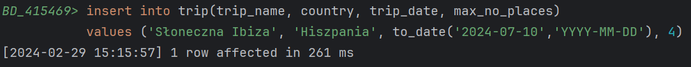
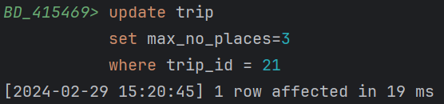
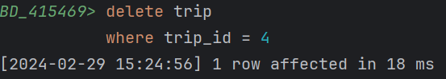

# Oracle PL/Sql

widoki, funkcje, procedury, triggery
ćwiczenie

---


Imiona i nazwiska autorów :
- Maciej Makowski
- Franciszek Job

---
<style>
  {
    font-size: 16pt;
  }
</style> 

<style scoped>
 li, p {
    font-size: 14pt;
  }
</style> 

<style scoped>
 pre {
    font-size: 10pt;
  }
</style> 

# Tabele


- `Trip`  - wycieczki
	- `trip_id` - identyfikator, klucz główny
	- `trip_name` - nazwa wycieczki
	- `country` - nazwa kraju
	- `trip_date` - data
	- `max_no_places` -  maksymalna liczba miejsc na wycieczkę
- `Person` - osoby
	- `person_id` - identyfikator, klucz główny
	- `firstname` - imię
	- `lastname` - nazwisko


- `Reservation`  - rezerwacje
	- `reservation_id` - identyfikator, klucz główny
	- `trip_id` - identyfikator wycieczki
	- `person_id` - identyfikator osoby
	- `status` - status rezerwacji
		- `N` – New - Nowa
		- `P` – Confirmed and Paid – Potwierdzona  i zapłacona
		- `C` – Canceled - Anulowana
- `Log` - dziennik zmian statusów rezerwacji 
	- `log_id` - identyfikator, klucz główny
	- `reservation_id` - identyfikator rezerwacji
	- `log_date` - data zmiany
	- `status` - status


```sql
create sequence s_person_seq  
   start with 1  
   increment by 1;

create table person  
(  
  person_id int not null
      constraint pk_person  
         primary key,
  firstname varchar(50),  
  lastname varchar(50)
)  

alter table person  
    modify person_id int default s_person_seq.nextval;
   
```


```sql
create sequence s_trip_seq  
   start with 1  
   increment by 1;

create table trip  
(  
  trip_id int  not null
     constraint pk_trip  
         primary key, 
  trip_name varchar(100),  
  country varchar(50),  
  trip_date date,  
  max_no_places int
)  

alter table trip 
    modify trip_id int default s_trip_seq.nextval;
```


```sql
create sequence s_reservation_seq  
   start with 1  
   increment by 1;

create table reservation  
(  
  reservation_id int not null
      constraint pk_reservation  
         primary key, 
  trip_id int,  
  person_id int,  
  status char(1)
)  

alter table reservation 
    modify reservation_id int default s_reservation_seq.nextval;


alter table reservation  
add constraint reservation_fk1 foreign key  
( person_id ) references person ( person_id ); 
  
alter table reservation  
add constraint reservation_fk2 foreign key  
( trip_id ) references trip ( trip_id );  
  
alter table reservation  
add constraint reservation_chk1 check  
(status in ('N','P','C'));

```


```sql
create sequence s_log_seq  
   start with 1  
   increment by 1;


create table log  
(  
    log_id int not null
         constraint pk_log  
         primary key,
    reservation_id int not null,  
    log_date datetime  not null,  
    status char(1)
);  

alter table log 
    modify log_id int default s_log_seq.nextval;
  
alter table log  
add constraint log_chk1 check  
(status in ('N','P','C')) enable;
  
alter table log  
add constraint log_fk1 foreign key  
( reservation_id ) references reservation ( reservation_id );
```


---
# Dane


Należy wypełnić  tabele przykładowymi danymi 
- 4 wycieczki
- 10 osób
- 10  rezerwacji

Dane testowe powinny być różnorodne (wycieczki w przyszłości, wycieczki w przeszłości, rezerwacje o różnym statusie itp.) tak, żeby umożliwić testowanie napisanych procedur.

W razie potrzeby należy zmodyfikować dane tak żeby przetestować różne przypadki.


```sql
-- trip
insert into trip(trip_name, country, trip_date, max_no_places)  
values ('Wycieczka do Paryza', 'Francja', to_date('2023-09-12', 'YYYY-MM-DD'), 3);  
  
insert into trip(trip_name, country, trip_date,  max_no_places)  
values ('Piekny Krakow', 'Polska', to_date('2025-05-03','YYYY-MM-DD'), 2);  
  
insert into trip(trip_name, country, trip_date,  max_no_places)  
values ('Znow do Francji', 'Francja', to_date('2025-05-01','YYYY-MM-DD'), 2);  
  
insert into trip(trip_name, country, trip_date,  max_no_places)  
values ('Hel', 'Polska', to_date('2025-05-01','YYYY-MM-DD'),  2);

-- person
insert into person(firstname, lastname)  
values ('Jan', 'Nowak');  
  
insert into person(firstname, lastname)  
values ('Jan', 'Kowalski');  
  
insert into person(firstname, lastname)  
values ('Jan', 'Nowakowski');  
  
insert into person(firstname, lastname)  
values  ('Novak', 'Nowak');

-- reservation
-- trip1
insert  into reservation(trip_id, person_id, status)  
values (1, 1, 'P');  
  
insert into reservation(trip_id, person_id, status)  
values (1, 2, 'N');  
  
-- trip 2  
insert into reservation(trip_id, person_id, status)  
values (2, 1, 'P');  
  
insert into reservation(trip_id, person_id, status)  
values (2, 4, 'C');  
  
-- trip 3  
insert into reservation(trip_id, person_id, status)  
values (2, 4, 'P');
```

---
# Zadanie 0 - modyfikacja danych, transakcje

Należy przeprowadzić kilka eksperymentów związanych ze wstawianiem, modyfikacją i usuwaniem danych
oraz wykorzystaniem transakcji

Skomentuj dzialanie transakcji. Jak działa polecenie `commit`, `rollback`?.
Co się dzieje w przypadku wystąpienia błędów podczas wykonywania transakcji? Porównaj sposób programowania operacji wykorzystujących transakcje w Oracle PL/SQL ze znanym ci systemem/językiem MS Sqlserver T-SQL

pomocne mogą być materiały dostępne tu:
https://upel.agh.edu.pl/mod/folder/view.php?id=214774
w szczególności dokument: `1_modyf.pdf`


```sql
#INSERT 
insert into trip(trip_name, country, trip_date, max_no_places) 
values ('Słoneczna Ibiza', 'Hiszpania', to_date('2024-07-10','YYYY-MM-DD'), 4);

#UPDATE 
update trip
set max_no_places=3
where trip_id = 21

#DELETE
delete trip
where trip_id = 4

#TRANSACTIONS
#toDo

```
- INSERT

- UPDATE 

- DELETE

- TRANSACTIONS
	- Transakcja jest to sekwencja operacji wykonywana jako pojdeyncza jednostka "pracy"
	- commit- potwierdza transakcje(wykonuje operacjie z których się składa)
	- rollback- wycofuje transakcje(nie wykonuje operacji z których się składa)
	- W razie błędu zazwyczaj transakcje zostaje przerwana, tzn. zmiany przez nią wprowadzone nie zostają zatwierdzone, również możemy takie błędy obsługiwać specjalnym blokiem EXCEPTION
	- T-SQL vs PL/SQL 
		- toDo


---
# Zadanie 1 - widoki


Tworzenie widoków. Należy przygotować kilka widoków ułatwiających dostęp do danych. Należy zwrócić uwagę na strukturę kodu (należy unikać powielania kodu)

Widoki:
-   `vw_reservation`
	- widok łączy dane z tabel: `trip`,  `person`,  `reservation`
	- zwracane dane:  `reservation_id`,  `country`, `trip_date`, `trip_name`, `firstname`, `lastname`, `status`, `trip_id`, `person_id`
- `vw_trip` 
	- widok pokazuje liczbę wolnych miejsc na każdą wycieczkę
	- zwracane dane: `trip_id`, `country`, `trip_date`, `trip_name`, `max_no_places`, `no_available_places` (liczba wolnych miejsc)
-  `vw_available_trip`
	- podobnie jak w poprzednim punkcie, z tym że widok pokazuje jedynie dostępne wycieczki (takie które są w przyszłości i są na nie wolne miejsca)


Proponowany zestaw widoków można rozbudować wedle uznania/potrzeb
- np. można dodać nowe/pomocnicze widoki
- np. można zmienić def. widoków, dodając nowe/potrzebne pola

# Zadanie 1  - rozwiązanie

```sql

#vw_reservation
create view VW_RESERVATION
as
select r.RESERVATION_ID, t.COUNTRY, t.TRIP_DATE, t.TRIP_NAME,
       p.FIRSTNAME, p.LASTNAME, r.STATUS, r.TRIP_ID, r.PERSON_ID
from RESERVATION r
join TRIP t on t.TRIP_ID = r.TRIP_ID
join PERSON p on p.PERSON_ID = r.PERSON_ID;

#vw_trip
create view VW_TRIP as
select trip.TRIP_ID, country, trip_date, trip_name,
	max_no_places, 
	(max_no_places- count(reservation_id)) as no_available_places
from TRIP
left join RESERVATION
on TRIP.TRIP_ID = RESERVATION.TRIP_ID and RESERVATION.STATUS not like 'C'
group by TRIP.TRIP_ID, country, trip_date, trip_name, max_no_places

#vw_available_trip
create or replace view VW_AVAILABLE_TRIP as
select t.TRIP_ID, t.TRIP_NAME, t.TRIP_DATE, t.COUNTRY,
       t.MAX_NO_PLACES, (t.MAX_NO_PLACES- count(r.RESERVATION_ID)) as no_available_places
from TRIP t
left join RESERVATION r on t.TRIP_ID = r.TRIP_ID AND r.STATUS not like 'C'
where t.TRIP_DATE > current_date
having count(r.RESERVATION_ID) < t.MAX_NO_PLACES
group by t.TRIP_ID, t.TRIP_NAME, t.TRIP_DATE, t.COUNTRY, t.MAX_NO_PLACES

```


---
# Zadanie 2  - funkcje


Tworzenie funkcji pobierających dane/tabele. Podobnie jak w poprzednim przykładzie należy przygotować kilka funkcji ułatwiających dostęp do danych

Procedury:
- `f_trip_participants`
	- zadaniem funkcji jest zwrócenie listy uczestników wskazanej wycieczki
	- parametry funkcji: `trip_id`
	- funkcja zwraca podobny zestaw danych jak widok  `vw_eservation`
-  `f_person_reservations`
	- zadaniem funkcji jest zwrócenie listy rezerwacji danej osoby 
	- parametry funkcji: `person_id`
	- funkcja zwraca podobny zestaw danych jak widok `vw_reservation`
-  `f_available_trips_to`
	- zadaniem funkcji jest zwrócenie listy wycieczek do wskazanego kraju, dostępnych w zadanym okresie czasu (od `date_from` do `date_to`)
	- parametry funkcji: `country`, `date_from`, `date_to`


Funkcje powinny zwracać tabelę/zbiór wynikowy. Należy rozważyć dodanie kontroli parametrów, (np. jeśli parametrem jest `trip_id` to można sprawdzić czy taka wycieczka istnieje). Podobnie jak w przypadku widoków należy zwrócić uwagę na strukturę kodu

Czy kontrola parametrów w przypadku funkcji ma sens?
- jakie są zalety/wady takiego rozwiązania?

Proponowany zestaw funkcji można rozbudować wedle uznania/potrzeb
- np. można dodać nowe/pomocnicze funkcje/procedury

# Zadanie 2  - rozwiązanie

```sql
#f_trip_participants
create type trip_participant as object (
  person_id number,
  firstname varchar2(50),
  lastname varchar2(50)
)
create type TRIP_PARTICIPANTS_TABLE as table of TRIP_PARTICIPANT

create function f_trip_participants(tripID number )
    return trip_participants_table
as
    result trip_participants_table;
begin
    select TRIP_PARTICIPANT(p.PERSON_ID, p.FIRSTNAME, p.LASTNAME)
    bulk collect into result
    from RESERVATION r
    join PERSON p on p.PERSON_ID = r.PERSON_ID and r.STATUS not like 'C'
    where r.TRIP_ID = tripID;
    return result;
end;

#f_person_reservations
create type person_reservation as object (
    reservation_id number,
    trip_id number,
    person_id number,
    status char
)
create type PERSON_RESERVATIONS_TABLE as table of PERSON_RESERVATION

create function f_person_reservations(personID number )
    return person_reservations_table
as
    result person_reservations_table;
begin
    select person_reservation(r.RESERVATION_ID, r.TRIP_ID, r.PERSON_ID, r.STATUS)
    bulk collect into result
    from RESERVATION r
    where r.PERSON_ID = personID;
    return result;
end;

#f_available_trips_to
create type trip_data as object(
    trip_id number,
    trip_name varchar2(100),
    country varchar2(50),
    trip_date date,
    max_no_places number
)
create type trips_table as table of TRIP_DATA

create FUNCTION f_available_trips_to(country_name VARCHAR2, date_from DATE, date_to DATE)
    RETURN trips_table
AS
    result trips_table;
BEGIN
      SELECT trip_data(t.TRIP_ID, t.TRIP_NAME, t.COUNTRY, t.TRIP_DATE, t.MAX_NO_PLACES)
      BULK COLLECT INTO result
      FROM TRIP t
      WHERE t.COUNTRY LIKE country_name AND t.TRIP_DATE BETWEEN date_from AND date_to;

      RETURN result;
END;

```


---
# Zadanie 3  - procedury


Tworzenie procedur modyfikujących dane. Należy przygotować zestaw procedur pozwalających na modyfikację danych oraz kontrolę poprawności ich wprowadzania

Procedury
- `p_add_reservation`
	- zadaniem procedury jest dopisanie nowej rezerwacji
	- parametry: `trip_id`, `person_id`, 
	- procedura powinna kontrolować czy wycieczka jeszcze się nie odbyła, i czy sa wolne miejsca
	- procedura powinna również dopisywać inf. do tabeli `log`
- `p_modify_reservation_status`
	- zadaniem procedury jest zmiana statusu rezerwacji 
	- parametry: `reservation_id`, `status` 
	- procedura powinna kontrolować czy możliwa jest zmiana statusu, np. zmiana statusu już anulowanej wycieczki (przywrócenie do stanu aktywnego nie zawsze jest możliwa – może już nie być miejsc)
	- procedura powinna również dopisywać inf. do tabeli `log`


Procedury:
- `p_modify_max_no_places`
	- zadaniem procedury jest zmiana maksymalnej liczby miejsc na daną wycieczkę 
	- parametry: `trip_id`, `max_no_places`
	- nie wszystkie zmiany liczby miejsc są dozwolone, nie można zmniejszyć liczby miejsc na wartość poniżej liczby zarezerwowanych miejsc

Należy rozważyć użycie transakcji

Należy zwrócić uwagę na kontrolę parametrów (np. jeśli parametrem jest trip_id to należy sprawdzić czy taka wycieczka istnieje, jeśli robimy rezerwację to należy sprawdzać czy są wolne miejsca itp..)


Proponowany zestaw procedur można rozbudować wedle uznania/potrzeb
- np. można dodać nowe/pomocnicze funkcje/procedury

# Zadanie 3  - rozwiązanie

```sql
#p_add_reservation
create procedure p_add_reservation(tripID in number, personID in number)
as
    trip_available_places number;
begin
    select no_available_places into trip_available_places
    from VW_AVAILABLE_TRIP
    where TRIP_ID = tripID;

    if trip_available_places is null then
        raise_application_error(-20001,'Trip with given ID does not exist');
    end if;

    if trip_available_places <= 0 then
        raise_application_error(-20002,'There are no available places in trip with given ID');
    end if;

    insert into RESERVATION(reservation_id, trip_id, person_id, status)
    values (S_RESERVATION_SEQ.nextval, tripID, personID, 'N');

    insert into LOG(log_id, reservation_id, log_date, status)
    values(S_LOG_SEQ.nextval,S_RESERVATION_SEQ.currval, trunc(sysdate), 'N');
commit;

exception
    when others then
        raise_application_error(-20003, 'Error inserting reservation: ' || SQLERRM);
end p_add_reservation;
#p_modify_status
TODO 


```


---
# Zadanie 4  - triggery


Zmiana strategii zapisywania do dziennika rezerwacji. Realizacja przy pomocy triggerów

Należy wprowadzić zmianę, która spowoduje, że zapis do dziennika rezerwacji będzie realizowany przy pomocy trierów

Triggery:
- trigger/triggery obsługujące 
	- dodanie rezerwacji
	- zmianę statusu
- trigger zabraniający usunięcia rezerwacji

Oczywiście po wprowadzeniu tej zmiany należy "uaktualnić" procedury modyfikujące dane. 

>UWAGA
Należy stworzyć nowe wersje tych procedur (dodając do nazwy dopisek 4 - od numeru zadania). Poprzednie wersje procedur należy pozostawić w celu  umożliwienia weryfikacji ich poprawności

Należy przygotować procedury: `p_add_reservation_4`, `p_modify_reservation_status_4` 


# Zadanie 4  - rozwiązanie

```sql

-- wyniki, kod, zrzuty ekranów, komentarz ...

```


---
# Zadanie 5  - triggery


Zmiana strategii kontroli dostępności miejsc. Realizacja przy pomocy triggerów

Należy wprowadzić zmianę, która spowoduje, że kontrola dostępności miejsc na wycieczki (przy dodawaniu nowej rezerwacji, zmianie statusu) będzie realizowana przy pomocy trierów

Triggery:
- Trigger/triggery obsługujące: 
	- dodanie rezerwacji
	- zmianę statusu

Oczywiście po wprowadzeniu tej zmiany należy "uaktualnić" procedury modyfikujące dane. 

>UWAGA
Należy stworzyć nowe wersje tych procedur (np. dodając do nazwy dopisek 5 - od numeru zadania). Poprzednie wersje procedur należy pozostawić w celu  umożliwienia weryfikacji ich poprawności. 

Należy przygotować procedury: `p_add_reservation_5`, `p_modify_reservation_status_5`


# Zadanie 5  - rozwiązanie

```sql

-- wyniki, kod, zrzuty ekranów, komentarz ...

```

---
# Zadanie 6


Zmiana struktury bazy danych. W tabeli `trip`  należy dodać  redundantne pole `no_available_places`.  Dodanie redundantnego pola uprości kontrolę dostępnych miejsc, ale nieco skomplikuje procedury dodawania rezerwacji, zmiany statusu czy też zmiany maksymalnej liczby miejsc na wycieczki.

Należy przygotować polecenie/procedurę przeliczającą wartość pola `no_available_places` dla wszystkich wycieczek (do jednorazowego wykonania)

Obsługę pola `no_available_places` można zrealizować przy pomocy procedur lub triggerów

Należy zwrócić uwagę na spójność rozwiązania.

>UWAGA
Należy stworzyć nowe wersje tych widoków/procedur/triggerów (np. dodając do nazwy dopisek 6 - od numeru zadania). Poprzednie wersje procedur należy pozostawić w celu  umożliwienia weryfikacji ich poprawności. 


- zmiana struktury tabeli

```sql
alter table trip add  
    no_available_places int null
```

- polecenie przeliczające wartość `no_available_places`
	- należy wykonać operację "przeliczenia"  liczby wolnych miejsc i aktualizacji pola  `no_available_places`

# Zadanie 6  - rozwiązanie

```sql

-- wyniki, kod, zrzuty ekranów, komentarz ...

```


---
# Zadanie 6a  - procedury


Obsługę pola `no_available_places` należy zrealizować przy pomocy procedur
- procedura dodająca rezerwację powinna aktualizować pole `no_available_places` w tabeli trip
- podobnie procedury odpowiedzialne za zmianę statusu oraz zmianę maksymalnej liczby miejsc na wycieczkę
- należy przygotować procedury oraz jeśli jest to potrzebne, zaktualizować triggery oraz widoki


>UWAGA
Należy stworzyć nowe wersje tych widoków/procedur/triggerów (np. dodając do nazwy dopisek 6a - od numeru zadania). Poprzednie wersje procedur należy pozostawić w celu  umożliwienia weryfikacji ich poprawności. 
- może  być potrzebne wyłączenie 'poprzednich wersji' triggerów 


# Zadanie 6a  - rozwiązanie

```sql

-- wyniki, kod, zrzuty ekranów, komentarz ...

```


---
# Zadanie 6b -  triggery


Obsługę pola `no_available_places` należy zrealizować przy pomocy triggerów
- podczas dodawania rezerwacji trigger powinien aktualizować pole `no_available_places` w tabeli trip
- podobnie, podczas zmiany statusu rezerwacji
- należy przygotować trigger/triggery oraz jeśli jest to potrzebne, zaktualizować procedury modyfikujące dane oraz widoki


>UWAGA
Należy stworzyć nowe wersje tych widoków/procedur/triggerów (np. dodając do nazwy dopisek 6b - od numeru zadania). Poprzednie wersje procedur należy pozostawić w celu  umożliwienia weryfikacji ich poprawności. 
- może  być potrzebne wyłączenie 'poprzednich wersji' triggerów 


# Zadanie 6b  - rozwiązanie


```sql

-- wyniki, kod, zrzuty ekranów, komentarz ...

```


# Zadanie 7 - podsumowanie

Porównaj sposób programowania w systemie Oracle PL/SQL ze znanym ci systemem/językiem MS Sqlserver T-SQL

```sql

-- komentarz ...

```