# Dokumentowe bazy danych – MongoDB

ćwiczenie 1


---

**Imiona i nazwiska autorów:**
Maciej Makowski
Franciszek Job

--- 

# Zadanie 1 - połączenie z serwerem bazy danych

Połącz się serwerem MongoDB

Można skorzystać z własnego/lokanego serwera MongoDB
Można stworzyć własny klaster/bazę danych w serwisie MongoDB Atlas
- [https://www.mongodb.com/atlas/database](https://www.mongodb.com/atlas/database)

Połącz za pomocą konsoli mongsh

Ewentualnie zdefiniuj połączenie w wybranym przez siebie narzędziu

Stwórz bazę danych/kolekcję/dokument
- może to być dowolna kolekcja, dowolny dokument – o dowolnej strukturze, chodzi o przetestowanie działania połączenia


---

## Zadanie 1  - rozwiązanie

#### Wyniki: 
- **połączenie za pomocą konsoli**
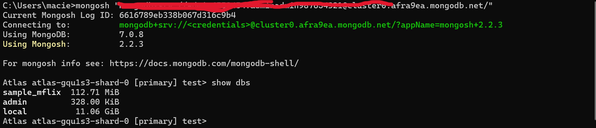
- **utworzenie bazy i dodanie przykładowych danych**
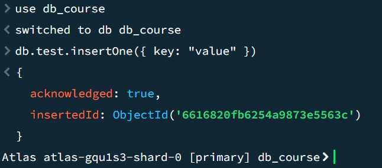
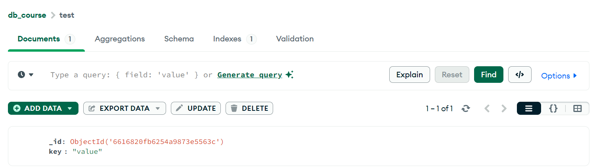

---


# Zadanie 2 - przykładowe zbiory danych

Zaimportuj przykładowe zbory danych

MongoDB Atlas Sample Dataset
- [https://docs.atlas.mongodb.com/sample-data](https://docs.atlas.mongodb.com/sample-data)
- w przypadku importu z lokalnych plików można wykorzystać polecenie `mongorestore`
	- [https://www.mongodb.com/docs/database-tools/mongorestore/](https://www.mongodb.com/docs/database-tools/mongorestore/)

```
mongorestore <data-dump-folder>
```

np.  

```
mongorestore samples
```

- Oczywiście, w przypadku łączenia się zdalnym serwerem należy podać parametry połączenia oraz dane logowania

Yelp Dataset

- wykorzystaj komendę `mongoimport`
- [https://www.mongodb.com/docs/database-tools/mongoimport](https://www.mongodb.com/docs/database-tools/mongoimport)

```
mongoimport --db <db-name> --collection <coll-name> --type json --file <file>
```


np.

```
mongoimport --db yelp --collection business --type json --file ./yelp_academic_dataset_business.json
```

- można też wykorzystać np.  narzędzie MongoDB Compass


Zapoznaj się ze strukturą przykładowych zbiorów danych/kolekcji
- W bazach danych: MongoDB Atlas Sample Dataset
	- Skomentuj struktury użyte w dokumentach dla dwóch wybranych zbiorów (takich które wydają ci się najciekawsze)
	- np. Sample Analitics Dataset i Sampe Traning Dataset

- W bazie Yelp
	- Skomentuj struktury użyte w dokumentach bazy Yelp

Przetestuj działanie operacji
- `mongodump`
	- [https://www.mongodb.com/docs/database-tools/mongodump/](https://www.mongodb.com/docs/database-tools/mongodump/)
- `mongoexport`
	- [https://www.mongodb.com/docs/database-tools/mongoexport/](https://www.mongodb.com/docs/database-tools/mongoexport/)

---

## Zadanie 2  - rozwiązanie

#### Wyniki: 
- **mongorestore**
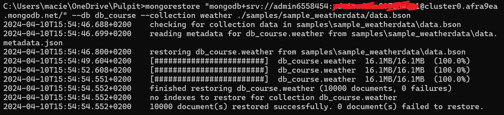

- **import za pomocą MongoDB Compass**
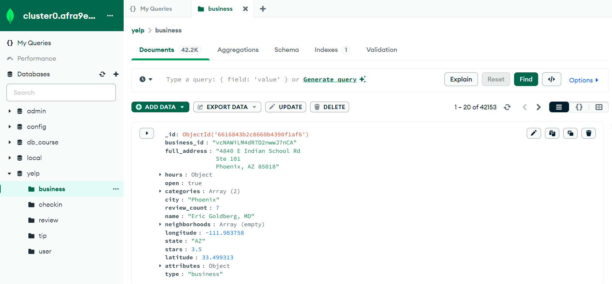

- **mongodump**
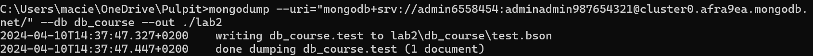

- **mongoexport**
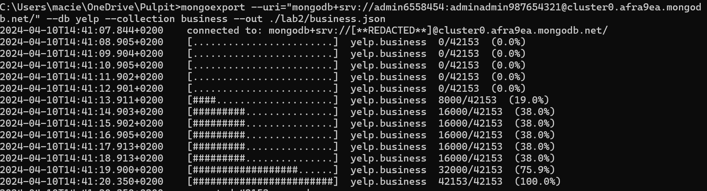

- **komentarz do yelp**

  1. **Businesses**:
     - Każda firma w bazie Yelp jest reprezentowana jako osobny dokument w kolekcji. Dokumenty te zawierają informacje o nazwie firmy, jej kategorii (np. restauracja, salon fryzjerski), adresie, godzinach otwarcia, ocenach, liczbie recenzji itp.

  2. **Users**:
     - Użytkownicy w Yelp również są reprezentowani jako osobne dokumenty w kolekcji. Mogą zawierać informacje takie jak nazwa użytkownika, adres e-mail, data dołączenia, oceny wystawione przez użytkownika, znajomi itp.

  3. **Reviews**:
     - Recenzje są osobnymi dokumentami, które łączą użytkowników z firmami. Zawierają informacje takie jak tekst recenzji, ocena (w skali od 1 do 5 gwiazdek), datę recenzji, oraz ID użytkownika i ID firmy.

  4. **Tips**:
     - Yelp przechowuje również komentarze dodawane przez użytkowników do profilu firmy. Komentarze są reprezentowane jako osobne dokumenty z polem tekstowym zawierającym treść komentarza, a także z metadanymi takimi jak autor komentarza, data dodania itp.

  5. **Checkin**:
     - Yelp przechowuje także informacje o ilości obecności użytkowników w danych firmach w danym dniu tygodnia i o danej godzinie, gdzie kluczami są pary wartości reprezentujące godzinę i dzień tygodnia, a wartościami są liczby reprezentujące liczbę "check-ins" w danym czasie i dniu tygodnia

- **komentarz do sample_weatherdata**
Dokument trzyma dane o warunkach pogodowych w danym miejscu i danym czasie. 

  1. **Lokalizacja**
   - Lokalizację trzyma za pomocą obiektu określającego typu pozycji np. punkt i jego współrzędne

  2. **Dane pogodowe**
   - Trzymane są w obiektach/tablicach których struktura zależy od charakteru danego pomiaru np.:
	```js
	"skyCondition": {
		"ceilingHeight": {
			"value": 99999,
			"quality": "9",
			"determination": "9"
    	},
    	"cavok": "N"
  }
	```
  3. **Czas i data**
   - Trzymane za pomocą stringa np.: 
  ```js
  "1984-03-05T13:00:00.000Z"
  ```


---

# Zadanie 3 - operacje CRUD, operacje wyszukiwania danych

[https://www.mongodb.com/docs/manual/crud/](https://www.mongodb.com/docs/manual/crud/)

Stwórz nową bazę danych
- baza danych będzie przechowywać informacje o klientach, produktach, zamowieniach tych produktów. itp.
- w nazwie bazy danych użyj swoich inicjałów
	- np. `AB-orders`
- zaproponuj strukturę kolekcji/dokumentów (dwie, maksymalnie 3 kolekcje)
	- wykorzystaj typy proste/podstawowe, dokumenty zagnieżdżone, tablice itp.
	- wprowadź kilka przykładowych dokumentów
	- przetestuj operacje wstawiania, modyfikacji/usuwania dokumentów
	- przetestuj operacje wyszukiwania dokumentów

## Zadanie 3  - rozwiązanie

#### Wyniki: 

- **Struktura kolekcji/dokumentów**
  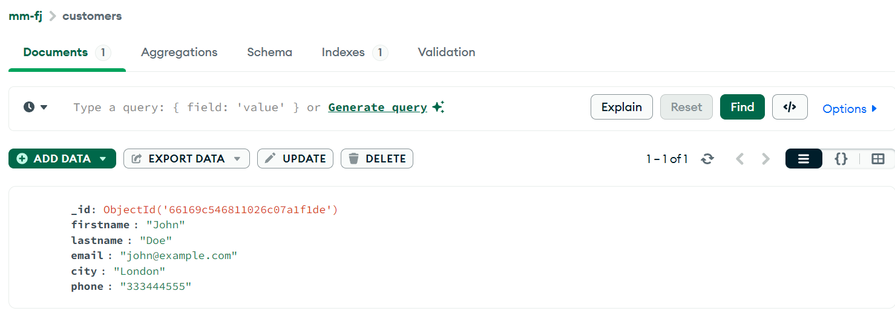
  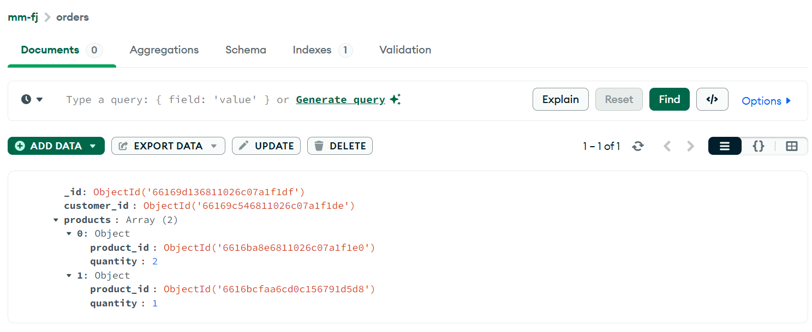
  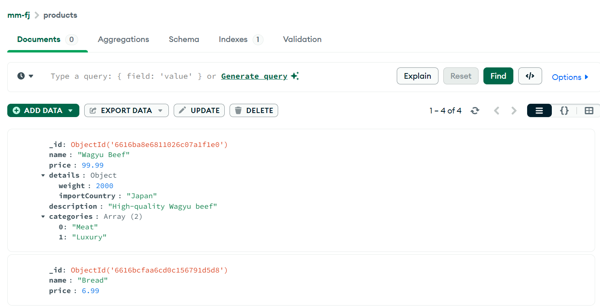

- **Insert**
	```js
	db.customers.insertOne({ "firstname": "John",lastname: "Doe", "email": "john@example.com", "city": "London", "phone": "123456789" })

	db.products.insertOne({name: "Bread", price: 6.99})
	
	db.products.insertOne({
	"name": "Wagyu Beef",
	"price": 99.99,
	"details": 
		{
			"weight": 2000,
			"importCountry": "Japan"
		},
	"description": "High-quality Wagyu beef",
	"categories": ["Meat", "Luxury"]
	})

	db.orders.insertOne({"customer_id":ObjectId("66169c546811026c07a1f1de"), "products": [{"product_id":ObjectId("66169b6f580acf2f9da1f1e0"), "quantity": 1}, {"product_id":ObjectId("6616bcfaa6cd0c156791d5d8"), "quantity":6}]})
	
	db.products.insertMany([{name: "Milk", price: 3.49}, {name: "Chocolate", price: 5}])
	```
- **Update**
  ```js
  db.customers.updateOne(
	{ "email": "john@example.com" },
	{ $set: { "phone": "333444555" } }
	) 
  ```

- **Delete**
  ```js
  db.products.deleteOne({"_id":ObjectId("66169bc0580acf2f9da1f1e1")})

  db.products.deleteMany({ "name": /a/ })//usuwa te produkty, które mają literę a
  ```

- **Find**
  ```js
  db.customers.findOne({"email":"john@example.com"})//email taki jak podany
  ```
  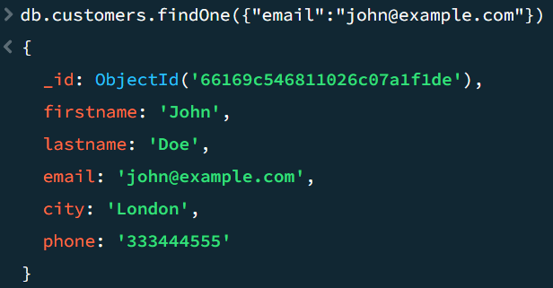

  ```js
  db.products.find({ "price": { $gt: 6 } })//cena większa od 6
  ```
  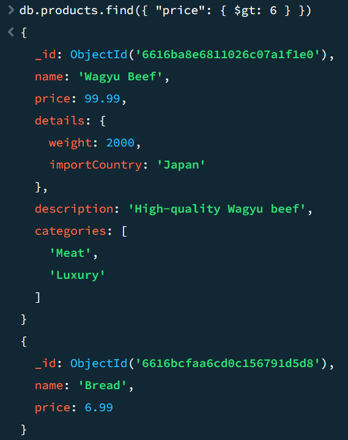

  ```js
  db.products.find({ "categories": { $in: ["Meat"] } })//produkt mający w tablicy kategorii kategorię "Meat"
  ```
  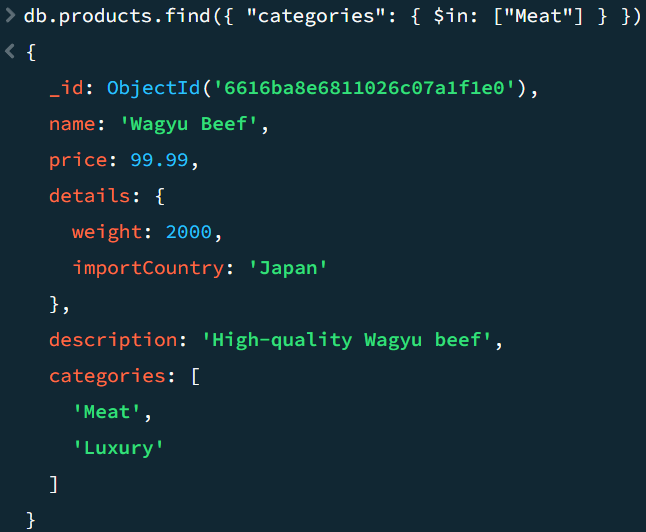
---

Ćwiczenie przeznaczone jest do wykonania podczas zajęć. Pod koniec zajęć należy przesłać wyniki prac

Punktacja:

|         |     |
| ------- | --- |
| zadanie | pkt |
| 1       | 0,1 |
| 2       | 0,2 |
| 3       | 0,7 |
| razem   | 1   |