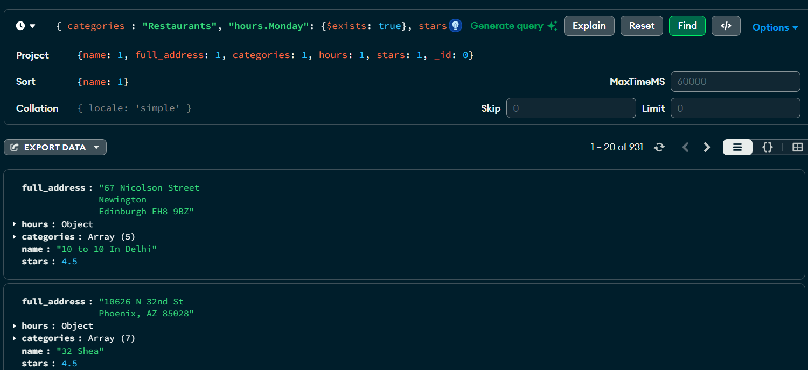
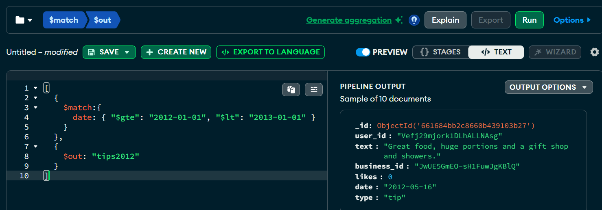
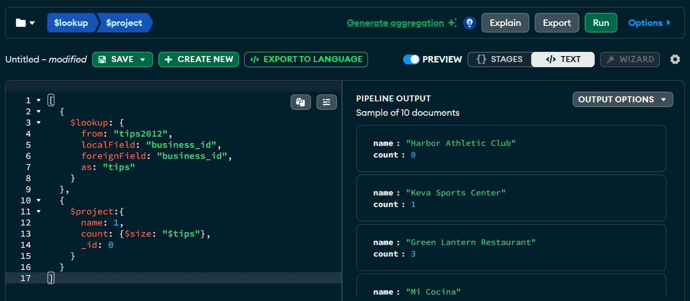
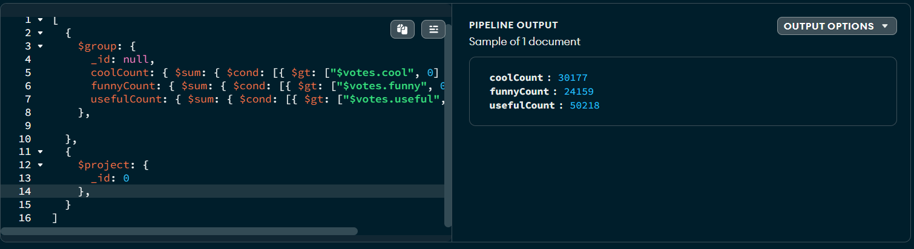
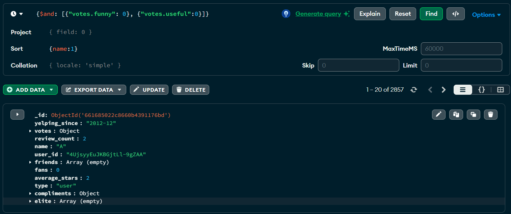
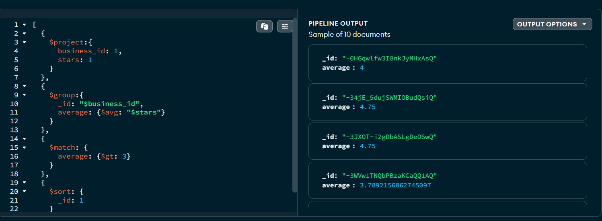
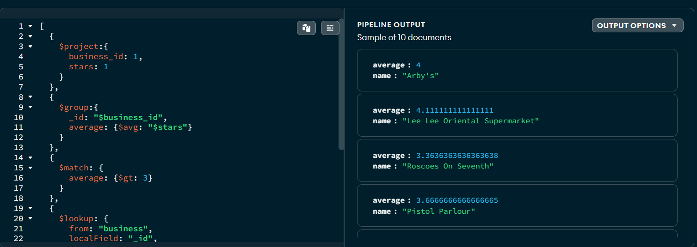

# Dokumentowe bazy danych – MongoDB

ćwiczenie 2


---

**Imiona i nazwiska autorów:**
Franciszek Job
Maciej Makowski

--- 


## Yelp Dataset

- [www.yelp.com](http://www.yelp.com) - serwis społecznościowy – informacje o miejscach/lokalach
- restauracje, kluby, hotele itd. `businesses`,
- użytkownicy odwiedzają te miejsca - "meldują się"  `check-in`
- użytkownicy piszą recenzje `reviews` o miejscach/lokalach i wystawiają oceny oceny,
- przykładowy zbiór danych zawiera dane z 5 miast: Phoenix, Las Vegas, Madison, Waterloo i Edinburgh.

# Zadanie 1 - operacje wyszukiwania danych

Dla zbioru Yelp wykonaj następujące zapytania

W niektórych przypadkach może być potrzebne wykorzystanie mechanizmu Aggregation Pipeline

[https://www.mongodb.com/docs/manual/core/aggregation-pipeline/](https://www.mongodb.com/docs/manual/core/aggregation-pipeline/)


1. Zwróć dane wszystkich restauracji (kolekcja `business`, pole `categories` musi zawierać wartość "Restaurants"), które są otwarte w poniedziałki (pole hours) i mają ocenę co najmniej 4 gwiazdki (pole `stars`).  Zapytanie powinno zwracać: nazwę firmy, adres, kategorię, godziny otwarcia i gwiazdki. Posortuj wynik wg nazwy firmy.

2. Ile każda firma otrzymała ocen/wskazówek (kolekcja `tip` ) w 2012. Wynik powinien zawierać nazwę firmy oraz liczbę ocen/wskazówek Wynik posortuj według liczby ocen (`tip`).

3. Recenzje mogą być oceniane przez innych użytkowników jako `cool`, `funny` lub `useful` (kolekcja `review`, pole `votes`, jedna recenzja może mieć kilka głosów w każdej kategorii).  Napisz zapytanie, które zwraca dla każdej z tych kategorii, ile sumarycznie recenzji zostało oznaczonych przez te kategorie (np. recenzja ma kategorię `funny` jeśli co najmniej jedna osoba zagłosowała w ten sposób na daną recenzję)

4. Zwróć dane wszystkich użytkowników (kolekcja `user`), którzy nie mają ani jednego pozytywnego głosu (pole `votes`) z kategorii (`funny` lub `useful`), wynik posortuj alfabetycznie według nazwy użytkownika.

5. Wyznacz, jaką średnia ocenę uzyskała każda firma na podstawie wszystkich recenzji (kolekcja `review`, pole `stars`). Ogranicz do firm, które uzyskały średnią powyżej 3 gwiazdek.

	a) Wynik powinien zawierać id firmy oraz średnią ocenę. Posortuj wynik wg id firmy.

	b) Wynik powinien zawierać nazwę firmy oraz średnią ocenę. Posortuj wynik wg nazwy firmy.

## Zadanie 1  - rozwiązanie

```js
//zadanie 1 
db.business.find( { categories : "Restaurants", "hours.Monday": {$exists: true}, stars: {$gt: 4} }, 
{name: 1, full_address: 1, categories: 1, hours: 1, stars: 1, _id: 0} )
.sort({name: 1})
```

```js
//zadanie 2
db.tips.aggregate([
  {
    $match:{
      date: { $gte: "2012-01-01", "$lt": "2013-01-01" }
    }
  },
  {
    $out: "tips2012"
  }
])

db.business.aggregate([
  {
    $lookup: {
      from: "tips2012",
      localField: "business_id",
      foreignField: "business_id",
      as: "tips"
    }
  },
  {
    $project:{
      name: 1,
      count: {$size: "$tips"},
      _id: 0
    }
  }
])


```


```js
//zadanie 3
db.review.aggregate([
  {
    $group: {
      _id: null,
      coolCount: { $sum: { $cond: [{ $gt: ["$votes.cool", 0] }, 1, 0] } },
      funnyCount: { $sum: { $cond: [{ $gt: ["$votes.funny", 0] }, 1, 0] } },
      usefulCount: { $sum: { $cond: [{ $gt: ["$votes.useful", 0] }, 1, 0] } }
    },    
  },
  {
    $project: {
      _id: 0      
    },
  }
])
```

```js
//zadanie 4
db.user.find({$and: [{"votes.funny": 0}, {"votes.useful":0}]}).sort({name:1})
```

```js
//zadanie 5 a)
db.review.aggregate([
  {
    $project:{
      business_id: 1,
      stars: 1
    }
  },
  {
    $group:{
      _id: "$business_id",
      average: {$avg: "$stars"}
    }
  },
  {
    $match: {
      average: {$gt: 3}
    }
  },
  {
    $sort: {
      _id: 1
    }
  }
])
//zadanie 5 b)
db.review.aggregate([
  {
    $project:{
      business_id: 1,
      stars: 1
    }
  },
  {
    $group:{
      _id: "$business_id",
      average: {$avg: "$stars"}
    }
  },
  {
    $match: {
      average: {$gt: 3}
    }
  },
  {
    $lookup: {
      from: "business",
      localField: "_id",
      foreignField: "business_id",
      as: "business"
    }
  },
  {
    $unwind: "$business"
  },
  {
    $project: {
      average: 1,
      name: "$business.name",
      _id: 0
    }
  }
])
```




# Zadanie 2 - modelowanie danych


Zaproponuj strukturę bazy danych dla wybranego/przykładowego zagadnienia/problemu

Należy wybrać jedno zagadnienie/problem (A lub B)

Przykład A
- Wykładowcy, przedmioty, studenci, oceny
	- Wykładowcy prowadzą zajęcia z poszczególnych przedmiotów
	- Studenci uczęszczają na zajęcia
	- Wykładowcy wystawiają oceny studentom
	- Studenci oceniają zajęcia

Przykład B
- Firmy, wycieczki, osoby
	- Firmy organizują wycieczki
	- Osoby rezerwują miejsca/wykupują bilety
	- Osoby oceniają wycieczki

a) Warto zaproponować/rozważyć różne warianty struktury bazy danych i dokumentów w poszczególnych kolekcjach oraz przeprowadzić dyskusję każdego wariantu (wskazać wady i zalety każdego z wariantów)

b) Kolekcje należy wypełnić przykładowymi danymi

c) W kontekście zaprezentowania wad/zalet należy zaprezentować kilka przykładów/zapytań/zadań/operacji oraz dla których dedykowany jest dany wariantów

W sprawozdaniu należy zamieścić przykładowe dokumenty w formacie JSON ( pkt a) i b)), oraz kod zapytań/operacji (pkt c)), wraz z odpowiednim komentarzem opisującym strukturę dokumentów oraz polecenia ilustrujące wykonanie przykładowych operacji na danych

Do sprawozdania należy kompletny zrzut wykonanych/przygotowanych baz danych (taki zrzut można wykonać np. za pomocą poleceń `mongoexport`, `mongdump` …) oraz plik z kodem operacji zapytań (załącznik powinien mieć format zip).


## Zadanie 2  - rozwiązanie
#### Wybraliśmy zagadnienie A

### Dekompozycja

##### Zalety:
- Unikanie duplikacji danych: Każdy element danych jest przechowywany tylko raz, co minimalizuje redundancję.
- Łatwiejsze zarządzanie dużymi zbiorami danych.
- Skalowalność: Lepsze zarządzanie dużymi ilościami danych dzięki rozproszeniu.
##### Wady:
- Złożoność zapytań: Zapytania mogą stać się bardziej złożone i mniej wydajne, gdyż wymagają łączenia danych z wielu kolekcji.
- Wyższy koszt zapytań: Złożone operacje "join" mogą być kosztowne w terminach wydajności, szczególnie w rozproszonych bazach danych.

Kolekcje:
1. `lecturers`
- wykładowcy prowadzą ćwiczenia/wykłady
- każdy dokument reprezentuje jednego wykładowcę
Schemat:
```json
{
  "_id": ObjectId,       
  "firstname": String, 
  "lastname": String,
  "email": String,
  "departmentId": ObjectId,
  "birdhDate": Date,    
  "subjectsIds": List<ObjectId>,
}
```

2. `students`
- studenci mogą uczęszczać na zajęcia/wykłady
- każdy dokumenty reprezentuje jednego studenta

```json
{
  "_id": ObjectId,       
  "firstname": String,     
  "lastname": String,      
  "email": String,  
  "birthDate": String,
  "courseIds": List<ObjectId>
}
```

3. `courses`
- na studia mogą zapisywać się studenci
- każdy dokument reprezentuje pojedynczy kierunek studiów
```json
{
  "_id": ObjectId,          
  "name": String,              
  "description": String,
  "departmentId": ObjectId
}
```

4. `departments`
- wydziały studiów

```json
{
  "_id": ObjectId,          
  "name": String,              
  "description": String,
}
```

5. `semesters`
```json
{
  "_id": ObjectId,          
  "semesterNumber": Int32,
  "startDate": Date,
  "endDate": Date,
  "courseId": ObjectId
}
```

6. `subjects`
```json
{
  "_id": ObjectId,
  "name": String,
  "description": String,
  "ECTSPoints": String
}
```

7. `classSeries`
- kazdy dokument reprezentuje przedmiot na danym semestrze
```json
{
  "_id": ObjectId,
  "semesterId": ObjectId,
  "subjectId": ObjectId,
  "lecturerId": ObjectId
}
```
8. `classes`
```json
{
  "_id": ObjectId,          
  "startDate": Date, // date includes both date and time of the class start/end
  "endDate": Date,
  "semesterId": ObjectId,
  "subjectId": ObjectId,
  "lecturerId": ObjectId
}
```

9. `classSerieRatings`
- każdy dokument reprezentuje pojedynczą ocenę zajęć na danym semestrze, którą wystawia student
```json
{
  "_id": ObjectId,
  "rating": Int32,
  "classSerieId": ObjectId,
  "studentId": ObjectId
}
```

10. `studentGrades`
- każdy dokument reprezentuje pojedynczą ocenę z przedmiotu, którą otrzymuje student

```json
{
  "_id": ObjectId,
  "grade": Int32,
  "studentId": ObjectId,
  "classSerieId": ObjectId
}
```

11. `classPresence`
- każdy dokument reprezentuje pojedynczą obecność studenta z `studentId` na zajęciach z `classId`
```json
{
  "_id": ObjectId,
  "classId": Object32,
  "studentId": Object32
}
```

Wstawianie przykładowych danych
```js
db.departments.insertMany([
    {
       
        "name": "Wydział Informatyki",
        "description": ""
    },
    {
   
        "name": "Wydział Matematki Stosowanej",
        "description": ""
    }
]);
```

```js
{
  acknowledged: true,
  insertedIds: {
    '0': ObjectId('6634d5922a42adfe4ecf7442'),
    '1': ObjectId('6634d5922a42adfe4ecf7443')
  }
}
```

```js
db.courses.insertMany([
    {
        "name": "Informatyka",
        "description": "Studia inżynierskie na kierunku informatyka",
        "departmentId": ObjectId("6634d5922a42adfe4ecf7442")
    },
    {
        "name": "Matematyka",
        "description": "Studia licencjackie na kierunki matematyka",
        "departmentId": ObjectId("6634d5922a42adfe4ecf7443")
    }
]);
```

```js
{
  acknowledged: true,
  insertedIds: {
    '0': ObjectId('6634d8722a42adfe4ecf7444'),
    '1': ObjectId('6634d8722a42adfe4ecf7445')
  }
}
```


```js
db.semesters.insertMany([
    {
        "semesterNumber": 1,
        "startDate": new Date("2023-10-01T00:00:00Z"),
        "endDate": new Date("2024-02-28T00:00:00Z"),
        "courseId": ObjectId("6634d5922a42adfe4ecf7442")
    },
    {
        "semesterNumber": 2,
        "startDate": new Date("2024-03-01T00:00:00Z"),
        "endDate": new Date("2024-07-31T00:00:00Z"),
        "courseId": ObjectId("6634d5922a42adfe4ecf7442")
    },
    {
        "semesterNumber": 1,
        "startDate": new Date("2023-10-01T00:00:00Z"),
        "endDate": new Date("2024-02-28T00:00:00Z"),
        "courseId": ObjectId("6634d5922a42adfe4ecf7443")
    },
    {
        "semesterNumber": 2,
        "startDate": new Date("2024-03-01T00:00:00Z"),
        "endDate": new Date("2024-07-31T00:00:00Z"),
        "courseId": ObjectId("6634d5922a42adfe4ecf7443")
    }
]);

```

```js
{
  acknowledged: true,
  insertedIds: {
    '0': ObjectId('6634d9ff2a42adfe4ecf7446'),
    '1': ObjectId('6634d9ff2a42adfe4ecf7447'),
    '2': ObjectId('6634d9ff2a42adfe4ecf7448'),
    '3': ObjectId('6634d9ff2a42adfe4ecf7449')
  }
}
```


```js
db.subjects.insertMany([
    {
     
        "name": "Algebra",
        "description": "Wykład: 42 godziny, Ćwiczenia audytoryjne: 42 godziny",
        "ECTSPoints": "6"
    },
    {
      
        "name": "Analiza matematyczna 1",
        "description": "Wykład: 42 godziny, Ćwiczenia audytoryjne: 42 godziny",
        "ECTSPoints": "6"
    },
    {
      
        "name": "Matematyka dyskretna",
        "description": "Wykład: 28 godzin, Ćwiczenia audytoryjne: 28 godzin",
        "ECTSPoints": "5"
    },
    {
      
        "name": "Analiza matematyczna 2",
        "description": "Wykład: 28 godzin, Ćwiczenia audytoryjne: 28 godzin",
        "ECTSPoints": "6"
    },
    {
     
        "name": "Logika matematyczna",
        "description": "Wykład: 14 godzin, Ćwiczenia audytoryjne: 14 godzin",
        "ECTSPoints": "4"
    },
    {
     
        "name": "Algorytmy i struktury danych",
        "description": "Wykład: 30 godzin, Ćwiczenia audytoryjne: 30 godzin",
        "ECTSPoints": "6"
    }
]);
```

```js
{
  acknowledged: true,
  insertedIds: {
    '0': ObjectId('6634e5462a42adfe4ecf744a'),
    '1': ObjectId('6634e5462a42adfe4ecf744b'),
    '2': ObjectId('6634e5462a42adfe4ecf744c'),
    '3': ObjectId('6634e5462a42adfe4ecf744d'),
    '4': ObjectId('6634e5462a42adfe4ecf744e'),
    '5': ObjectId('6634e5462a42adfe4ecf744f')
  }
}
```

```js
db.lecturers.insertMany([
    {
        "firstname": "Lech",
        "lastname": "Adamus",
        "email": "lech.adamus@agh.edu.pl",
        "departmentId": ObjectId("6634d5922a42adfe4ecf7442"), // Wydział Informatyki
        "birthDate": new Date("1960-03-10T00:00:00Z"),
        "subjectsIds": [
            ObjectId("6634e5462a42adfe4ecf744a"), // Algebra
            ObjectId("6634e5462a42adfe4ecf744d")  // Analiza matematyczna 2
        ]
    },
    {
        "firstname": "Wacław",
        "lastname": "Frydrych",
        "email": "waclaw.frydrych@agh.edu.pl",
        "departmentId": ObjectId("6634d5922a42adfe4ecf7442"), // Wydział Informatyki
        "birthDate": new Date("1958-06-18T00:00:00Z"),
        "subjectsIds": [
            ObjectId("6634e5462a42adfe4ecf744b")  // Analiza matematyczna 1
        ]
    },
    {
        "firstname": "Mariusz",
        "lastname": "Meszka",
        "email": "mariusz.meszka@agh.edu.pl",
        "departmentId": ObjectId("6634d5922a42adfe4ecf7442"), // Wydział Informatyki
        "birthDate": new Date("1972-11-05T00:00:00Z"),
        "subjectsIds": [
            ObjectId("6634e5462a42adfe4ecf744c")  // Matematyka dyskretna
        ]
    },
    {
        "firstname": "Barbara",
        "lastname": "Głut",
        "email": "barbara.glut@agh.edu.pl",
        "departmentId": ObjectId("6634d5922a42adfe4ecf7442"), // Wydział Informatyki
        "birthDate": new Date("1967-09-23T00:00:00Z"),
        "subjectsIds": [
            ObjectId("6634e5462a42adfe4ecf744e"), // Logika matematyczna
            ObjectId("6634e5462a42adfe4ecf744f")  // Algorytmy i struktury danych
        ]
    },
    {
        "firstname": "Piotr",
        "lastname": "Faliszewski",
        "email": "piotr.faliszewski@agh.edu.pl",
        "departmentId": ObjectId("6634d5922a42adfe4ecf7442"), // Wydział Informatyki
        "birthDate": new Date("1980-05-15T00:00:00Z"),
        "subjectsIds": [
            ObjectId("6634e5462a42adfe4ecf744f")  // Algorytmy i struktury danych
        ]
    }
]);

```

```js
{
  acknowledged: true,
  insertedIds: {
    '0': ObjectId('6634e9e72a42adfe4ecf7456'),
    '1': ObjectId('6634e9e72a42adfe4ecf7457'),
    '2': ObjectId('6634e9e72a42adfe4ecf7458'),
    '3': ObjectId('6634e9e72a42adfe4ecf7459'),
    '4': ObjectId('6634e9e72a42adfe4ecf745a')
  }
}
```

```js
const firstSemesterId = ObjectId("6634d9ff2a42adfe4ecf7446"); // ID 1. semestru na informatyce
const secondSemesterId = ObjectId("6634d9ff2a42adfe4ecf7447"); // ID 2. semestru na informatyce

db.classSeries.insertMany([
    {
        "semesterId": firstSemesterId,
        "subjectId": ObjectId("6634e5462a42adfe4ecf744a"), // Algebra
        "lecturerId": ObjectId("63f3cfe2a42adfe4ecf7b312") // Lech Adamus
    },
    {
        "semesterId": firstSemesterId,
        "subjectId": ObjectId("6634e5462a42adfe4ecf744b"), // Analiza matematyczna 1
        "lecturerId": ObjectId("63f3cfe2a42adfe4ecf7b313") // Wacław Frydrych
    },
    {
        "semesterId": firstSemesterId,
        "subjectId": ObjectId("6634e5462a42adfe4ecf744c"), // Matematyka dyskretna
        "lecturerId": ObjectId("63f3cfe2a42adfe4ecf7b314") // Mariusz Meszka
    },
    {
        "semesterId": secondSemesterId,
        "subjectId": ObjectId("6634e5462a42adfe4ecf744d"), // Analiza matematyczna 2
        "lecturerId": ObjectId("63f3cfe2a42adfe4ecf7b312") // Lech Adamus
    },
    {
        "semesterId": secondSemesterId,
        "subjectId": ObjectId("6634e5462a42adfe4ecf744e"), // Logika matematyczna
        "lecturerId": ObjectId("63f3cfe2a42adfe4ecf7b315") // Barbara Głut
    },
    {
        "semesterId": secondSemesterId,
        "subjectId": ObjectId("6634e5462a42adfe4ecf744f"), // Algorytmy i struktury danych
        "lecturerId": ObjectId("63f3cfe2a42adfe4ecf7b316") // Piotr Faliszewski
    }
]);

```

```js
{
  acknowledged: true,
  insertedIds: {
    '0': ObjectId('6634f17b2a42adfe4ecf74a1'),
    '1': ObjectId('6634f17b2a42adfe4ecf74a2'),
    '2': ObjectId('6634f17b2a42adfe4ecf74a3'),
    '3': ObjectId('6634f17b2a42adfe4ecf74a4'),
    '4': ObjectId('6634f17b2a42adfe4ecf74a5'),
    '5': ObjectId('6634f17b2a42adfe4ecf74a6')
  }
}
```


```js
db.students.insertMany([
    {
        "firstname": "Franciszek",
        "lastname": "Job",
        "email": "franciszek.job@student.agh.edu.pl",
        "birthDate": new Date("1999-04-12T00:00:00Z"),
        "courseIds": [ObjectId("6634d5922a42adfe4ecf7442")]
    },
    {
        "firstname": "Maciej",
        "lastname": "Makowski",
        "email": "maciej.makowski@student.agh.edu.pl",
        "birthDate": new Date("1998-06-21T00:00:00Z"),
        "courseIds": [ObjectId("6634d5922a42adfe4ecf7442")]
    }
]);

```

```js
{
  acknowledged: true,
  insertedIds: {
    '0': ObjectId('6634eb422a42adfe4ecf745b'),
    '1': ObjectId('6634eb422a42adfe4ecf745c')
  }
}
```


```js
const classSeriesIdsSemester1 = [
    ObjectId("6634f17b2a42adfe4ecf74a1"), // Algebra
    ObjectId("6634f17b2a42adfe4ecf74a2"), // Analiza matematyczna 1
    ObjectId("6634f17b2a42adfe4ecf74a3")  // Matematyka dyskretna
];

const classSeriesIdsSemester2 = [
    ObjectId("6634f17b2a42adfe4ecf74a4"), // Analiza matematyczna 2
    ObjectId("6634f17b2a42adfe4ecf74a5"), // Logika matematyczna
    ObjectId("6634f17b2a42adfe4ecf74a6")  // Algorytmy i struktury danych
];

const generateClassTimings = (startHour, startMinute, currentDate) => {
    const startDateTime = new Date(currentDate.getFullYear(), currentDate.getMonth(), currentDate.getDate(), startHour, startMinute);
    const endDateTime = new Date(startDateTime.getTime() + 90 * 60 * 1000); // dodaje 1.5h

    return { startDate: startDateTime, endDate: endDateTime };
};

const generateClasses = (classSerieId, startDate) => {
    const classes = [];
    let currentDate = new Date(startDate);
    let startHour = 8;
    let startMinute = 0;

    for (let i = 0; i < 10; i++) {
        const { startDate, endDate } = generateClassTimings(startHour, startMinute, currentDate);
        classes.push({
            "classSerieId": classSerieId,
            "startDate": startDate,
            "endDate": endDate
        });

        // Przesuwamy datę na kolejny tydzień
        currentDate.setDate(currentDate.getDate() + 7);
    }

    return classes;
};

const firstSemesterStartDate = new Date("2023-10-01T00:00:00Z");
const secondSemesterStartDate = new Date("2024-03-01T00:00:00Z");

let allClasses = [];
for (const classSerieId of classSeriesIdsSemester1) {
    allClasses = allClasses.concat(generateClasses(classSerieId, firstSemesterStartDate));
}
for (const classSerieId of classSeriesIdsSemester2) {
    allClasses = allClasses.concat(generateClasses(classSerieId, secondSemesterStartDate));
}

db.classes.insertMany(allClasses);

```

```js
{
  acknowledged: true,
  insertedIds: {
    '0': ObjectId('6634fa512a42adfe4ecf74a7'),
    '1': ObjectId('6634fa512a42adfe4ecf74a8'),
    '2': ObjectId('6634fa512a42adfe4ecf74a9'),
    '3': ObjectId('6634fa512a42adfe4ecf74aa'),
    '4': ObjectId('6634fa512a42adfe4ecf74ab'),
    '5': ObjectId('6634fa512a42adfe4ecf74ac'),
    '6': ObjectId('6634fa512a42adfe4ecf74ad'),
    '7': ObjectId('6634fa512a42adfe4ecf74ae'),
    '8': ObjectId('6634fa512a42adfe4ecf74af'),
    '9': ObjectId('6634fa512a42adfe4ecf74b0'),
    '10': ObjectId('6634fa512a42adfe4ecf74b1'),
    '11': ObjectId('6634fa512a42adfe4ecf74b2'),
    '12': ObjectId('6634fa512a42adfe4ecf74b3'),
    '13': ObjectId('6634fa512a42adfe4ecf74b4'),
    '14': ObjectId('6634fa512a42adfe4ecf74b5'),
    '15': ObjectId('6634fa512a42adfe4ecf74b6'),
    '16': ObjectId('6634fa512a42adfe4ecf74b7'),
    '17': ObjectId('6634fa512a42adfe4ecf74b8'),
    '18': ObjectId('6634fa512a42adfe4ecf74b9'),
    '19': ObjectId('6634fa512a42adfe4ecf74ba'),
    '20': ObjectId('6634fa512a42adfe4ecf74bb'),
    '21': ObjectId('6634fa512a42adfe4ecf74bc'),
    '22': ObjectId('6634fa512a42adfe4ecf74bd'),
    '23': ObjectId('6634fa512a42adfe4ecf74be'),
    '24': ObjectId('6634fa512a42adfe4ecf74bf'),
    '25': ObjectId('6634fa512a42adfe4ecf74c0'),
    '26': ObjectId('6634fa512a42adfe4ecf74c1'),
    '27': ObjectId('6634fa512a42adfe4ecf74c2'),
    '28': ObjectId('6634fa512a42adfe4ecf74c3'),
    '29': ObjectId('6634fa512a42adfe4ecf74c4'),
    '30': ObjectId('6634fa512a42adfe4ecf74c5'),
    '31': ObjectId('6634fa512a42adfe4ecf74c6'),
    '32': ObjectId('6634fa512a42adfe4ecf74c7'),
    '33': ObjectId('6634fa512a42adfe4ecf74c8'),
    '34': ObjectId('6634fa512a42adfe4ecf74c9'),
    '35': ObjectId('6634fa512a42adfe4ecf74ca'),
    '36': ObjectId('6634fa512a42adfe4ecf74cb'),
    '37': ObjectId('6634fa512a42adfe4ecf74cc'),
    '38': ObjectId('6634fa512a42adfe4ecf74cd'),
    '39': ObjectId('6634fa512a42adfe4ecf74ce'),
    '40': ObjectId('6634fa512a42adfe4ecf74cf'),
    '41': ObjectId('6634fa512a42adfe4ecf74d0'),
    '42': ObjectId('6634fa512a42adfe4ecf74d1'),
    '43': ObjectId('6634fa512a42adfe4ecf74d2'),
    '44': ObjectId('6634fa512a42adfe4ecf74d3'),
    '45': ObjectId('6634fa512a42adfe4ecf74d4'),
    '46': ObjectId('6634fa512a42adfe4ecf74d5'),
    '47': ObjectId('6634fa512a42adfe4ecf74d6'),
    '48': ObjectId('6634fa512a42adfe4ecf74d7'),
    '49': ObjectId('6634fa512a42adfe4ecf74d8'),
    '50': ObjectId('6634fa512a42adfe4ecf74d9'),
    '51': ObjectId('6634fa512a42adfe4ecf74da'),
    '52': ObjectId('6634fa512a42adfe4ecf74db'),
    '53': ObjectId('6634fa512a42adfe4ecf74dc'),
    '54': ObjectId('6634fa512a42adfe4ecf74dd'),
    '55': ObjectId('6634fa512a42adfe4ecf74de'),
    '56': ObjectId('6634fa512a42adfe4ecf74df'),
    '57': ObjectId('6634fa512a42adfe4ecf74e0'),
    '58': ObjectId('6634fa512a42adfe4ecf74e1'),
    '59': ObjectId('6634fa512a42adfe4ecf74e2')
  }
}
```


```js
db.classSerieRatings.insertMany([
    {
        "rating": 5,
        "classSerieId": ObjectId("6634e5462a42adfe4ecf744a"), // Algebra
        "studentId": ObjectId("63f3cfe2a42adfe4ecf7b400") // Franciszek Job
    },
    {
        "rating": 4,
        "classSerieId": ObjectId("6634e5462a42adfe4ecf744b"), // Analiza matematyczna 1
        "studentId": ObjectId("63f3cfe2a42adfe4ecf7b401") // Maciej Makowski
    },
    {
        "rating": 3,
        "classSerieId": ObjectId("6634e5462a42adfe4ecf744c"), // Matematyka dyskretna
        "studentId": ObjectId("63f3cfe2a42adfe4ecf7b400") // Franciszek Job
    },
    {
        "rating": 2,
        "classSerieId": ObjectId("6634e5462a42adfe4ecf744d"), // Analiza matematyczna 2
        "studentId": ObjectId("63f3cfe2a42adfe4ecf7b401") // Maciej Makowski
    }
]);

```

```js
{
  acknowledged: true,
  insertedIds: {
    '0': ObjectId('6634fdce2a42adfe4ecf74e3'),
    '1': ObjectId('6634fdce2a42adfe4ecf74e4'),
    '2': ObjectId('6634fdce2a42adfe4ecf74e5'),
    '3': ObjectId('6634fdce2a42adfe4ecf74e6')
  }
}
```

```js
db.studentGrades.insertMany([
    {
        "grade": 4,
        "studentId": ObjectId("6634eb422a42adfe4ecf745b"), // Franciszek Job
        "classSerieId": ObjectId("6634e5462a42adfe4ecf744a") // Algebra
    },
    {
        "grade": 3,
        "studentId": ObjectId("6634eb422a42adfe4ecf745b"), // Franciszek Job
        "classSerieId": ObjectId("6634e5462a42adfe4ecf744b") // Analiza matematyczna 1
    },
    {
        "grade": 4,
        "studentId": ObjectId("6634eb422a42adfe4ecf745c"), // Maciej Makowski
        "classSerieId": ObjectId("6634e5462a42adfe4ecf744a") // Algebra
    },
    {
        "grade": 3,
        "studentId": ObjectId("6634eb422a42adfe4ecf745c"), // Maciej Makowski
        "classSerieId": ObjectId("6634e5462a42adfe4ecf744b") // Analiza matematyczna 1
    },
    ...
]);

```

```js
{
  acknowledged: true,
  insertedIds: {
    '0': ObjectId('66350f502a42adfe4ecf74ed'),
    '1': ObjectId('66350f502a42adfe4ecf74ee'),
    '2': ObjectId('66350f502a42adfe4ecf74ef'),
    '3': ObjectId('66350f502a42adfe4ecf74f0'),
    ...
  }
}
```

```js
// Pobierz studentów o nazwiskach "Makowski" i "Job"
const students = db.students.find({ lastname: { $in: ["Makowski", "Job"] } }).toArray();

// Pobierz wszystkie możliwe zajęcia
const classes = db.classes.find().toArray();

// Przygotuj tablicę zadań BulkWrite
const bulkOps = [];

// Pętla dla każdego studenta
for (let i = 0; i < students.length; i++) {
    const studentId = students[i]._id;

    // Pętla dla każdego zajęcia
    for (let j = 0; j < classes.length; j++) {
        const classId = classes[j]._id;

        // Dodaj zadanie BulkWrite dla każdego studenta na danym zajęciu
        bulkOps.push({
            insertOne: {
                document: {
                    classId: classId,
                    studentId: studentId
                }
            }
        });
    }
}

// Wykonaj operację BulkWrite
db.classPresence.bulkWrite(bulkOps);

```


#### Zapytanie 1: Pobranie wszystkich studentów wraz z ich ocenami


```js
db.students.aggregate([
  {
    $lookup: {
      from: "studentGrades",
      localField: "_id",
      foreignField: "studentId",
      as: "grades"
    }
  },
  {
    $project: {
      firstname: 1,
      lastname: 1,
      email: 1,
      grades: "$grades.grade"
    }
  }
])
```

#### Rezultat
```js
{
  _id: ObjectId('6634eb422a42adfe4ecf745b'),
  firstname: 'Franciszek',
  lastname: 'Job',
  email: 'franciszek.job@student.agh.edu.pl',
  grades: [
    4,
    3,
    5,
    3,
    4,
    4,
    5,
    3,
    4,
    5,
    3
  ]
}
... // dalej analogicznie
```

#### Zapytanie 2: Pobranie średniej kazdego ucznia na kazdy semestr (przydatne podczas rozdzielania stypendium)
```js
db.students.aggregate([
  {
    $lookup: {
      from: "studentGrades",
      localField: "_id",
      foreignField: "studentId",
      as: "grades"
    }
  },
  {
    $unwind: "$grades"
  },
  {
    $lookup: {
      from: "classSeries",
      localField: "grades.classSerieId",
      foreignField: "_id",
      as: "classSeries"
    }
  },
  {
    $unwind: "$classSeries"
  },
  {
    $lookup: {
      from: "semesters",
      localField: "classSeries.semesterId",
      foreignField: "_id",
      as: "semester"
    }
  },
  {
    $unwind: "$semester"
  },
  {
    $group: {
      _id: {
        studentId: "$_id",
        semesterId: "$semester._id"
      },
      averageGrade: { $avg: "$grades.grade" }
    }
  },
  {
    $lookup: {
      from: "students",
      localField: "_id.studentId",
      foreignField: "_id",
      as: "student"
    }
  },
  {
    $unwind: "$student"
  },
  {
    $lookup: {
      from: "semesters",
      localField: "_id.semesterId",
      foreignField: "_id",
      as: "semester"
    }
  },
  {
    $unwind: "$semester"
  },
  {
    $project: {
      _id: 0,
      semesterNumber: "$semester.semesterNumber",
      student: {
        firstname: "$student.firstname",
        lastname: "$student.lastname"
      },
      averageGrade: 1
    }
  }
])
```
#### Rezultat
```js
{
  averageGrade: 4.25,
  student: {
    firstname: 'Franciszek',
    lastname: 'Job'
  },
  semesterNumber: 2
}
{
  averageGrade: 4,
  student: {
    firstname: 'Maciej',
    lastname: 'Makowski'
  },
  semesterNumber: 2
}
...
```

#### Zapytanie 3: Pobranie listy kierunków studiów wraz z liczbą na nich studjujących
```js
db.students.aggregate([
  {
    $unwind: "$courseIds"
  },
  {
    $group: {
      _id: "$courseIds",
      totalStudents: { $sum: 1 }
    }
  },
  {
    $lookup: {
      from: "courses",
      localField: "_id",
      foreignField: "_id",
      as: "course"
    }
  },
  {
    $project: {
      _id: 1,

      totalStudents: 1
    }
  }
])
```

#### Rezultat
```js
{
  // matematyka
  _id: ObjectId('6634d5922a42adfe4ecf7443'),
  totalStudents: 2
}
{
  // informatyka
  _id: ObjectId('6634d5922a42adfe4ecf7442'),
  totalStudents: 2
}
```

#### Operacja 1: Dodanie nowych zajęć dla informatyki na 1 semestrze z przedmiotu algebra
```json
db.classes.insertOne({
  "startDate": new Date("2024-09-01T08:00:00Z"),
  "endDate": new Date("2024-09-01T09:30:00Z"),
  "classSeriesId": "6634f17b2a42adfe4ecf74a1", // Algebra na 1 semestrze informatyki
});
```

#### Rezultat
```json
{
  acknowledged: true,
  insertedId: ObjectId('6637fc2019378c8e1ea05707')
}
```

#### Operacja 2: Dodanie obecności na zajęciach dla informatyki na 1 semestrze z przedmiotu algebra dla studenta z id 6634eb422a42adfe4ecf745b
```json
db.classPresence.insertOne({
  "classId": ObjectId("6637fc2019378c8e1ea05707"),
  "studentId": ObjectId("6634eb422a42adfe4ecf745b")
});
```

#### Rezultat
```json
{
  acknowledged: true,
  insertedId: ObjectId('6637fd8519378c8e1ea05708')
}
```


### Zagnieżdzanie
##### Zalety:
- Wydajność zapytań: Zapytania są szybkie bo wszystkie dane są zapisane w jednym dokumencie.
- Prostota modelu: Model danych jest często prostszy i bardziej zrozumiały, gdy wszystkie powiązane dane są zapisane razem.
##### Wady:
- Potencjalna redundancja: Może dochodzić do duplikacji danych, jeśli te same informacje są powielane w różnych dokumentach.
- Trudności w aktualizacjach jeśli wiele osób jednocześnie aktualizuje dane.
- Ograniczenia rozmiaru dokumentu: MongoDB ma ograniczenie wielkości dokumentu, co może być problemem przy bardzo dużych zagnieżdżonych strukturach.

Kolekcje:


`students`
```json
{
  "_id": ObjectId,
  "firstname": String,
  "lastname": String,
  "email": String,
  "birthDate": Date,
  "courses": [
    {
      "name": String,
      "description": String,
      "department":
      {
        "_id": ObjectId,          
        "name": String,              
        "description": String,
      },
      "semesters": [
        {
          "subjects": [
            {
              "name": String,
              "description": String,
              "ECTSPoints": String,

                  "lecturer": {
                    "firstname": String,
                    "lastname": String,
                    "email": String
                  },
                  "rating": Int32,
                  "grades": [Int32],
                  "classes": [
                    {
                      "startDate": Date,
                      "endDate": Date,
                      "present": true
                    },
                    {
                      "startDate": Date,
                      "endDate": Date,
                      "present": false
                    }
                  ]
            }
          ],
          "semesterNumber": Int32,
          "startDate": Date,
          "endDate": Date
        }
      ]
    }
  ]
}

```


Przykładowy dokument
```json
{
  "firstname": "Franciszek",
  "lastname": "Job",
  "email": "franciszek.job@student.agh.edu.pl",
  "birthDate": ISODate("1998-03-21"),
  "courses": [
    {
      "name": "Matematyka",
      "description": "Kierunek matematyczny",
      "department": {
        "name": "Matematyka",
        "description": "Wydział matematyczny"
      },
      "semesters": [
        {
          "semesterNumber": 1,
          "startDate": ISODate("2022-10-01"),
          "endDate": ISODate("2023-02-28"),
          "subjects": [
            {
              "name": "Analiza matematyczna",
              "description": "Podstawy analizy matematycznej",
              "ECTSPoints": "6",
              "lecturer": {
                "firstname": "Wacław",
                "lastname": "Frydrych",
                "email": "waclaw.frydrych@agh.edu.pl"
              },
              "rating": 5,
              "grades": [5, 4, 5, 5],
              "classes": [
                {
                  "startDate": ISODate("2022-10-01T08:00:00Z"),
                  "endDate": ISODate("2022-10-01T09:30:00Z"),
                  "present": true
                },
                {
                  "startDate": ISODate("2022-10-08T08:00:00Z"),
                  "endDate": ISODate("2022-10-08T09:30:00Z"),
                  "present": false
                }
              ]
            },
            {
              "name": "Algebra",
              "description": "",
              "ECTSPoints": "5",
              "lecturer": {
                "firstname": "Lech",
                "lastname": "Adamus",
                "email": "lech.adamus@agh.edu.pl"
              },
              "rating": 4,
              "grades": [3,3,4],
              "classes": [
                {
                  "startDate": ISODate("2022-11-01T08:00:00Z"),
                  "endDate": ISODate("2022-11-01T09:30:00Z"),
                  "present": true
                },
                {
                  "startDate": ISODate("2022-11-08T08:00:00Z"),
                  "endDate": ISODate("2022-11-08T09:30:00Z"),
                  "present": false
                }
              ]
            }
          ]
        }
      ]
    }
  ]
}
```

#### Zapytanie 1: Pobranie wszystkich studentów wraz z ich ocenami
```json
db.students.aggregate([
  {
    $project: {
      _id: 1,
      firstname: 1,
      lastname: 1,
      "courses.semesters.subjects.name": 1,
      "courses.semesters.subjects.classSeries.grades": 1
    }
  }
])
```
#### Rezultat
```json
{
  _id: ObjectId('6637eda219378c8e1ea05703'),
  firstname: 'Franciszek',
  lastname: 'Job',
  courses: [
    {
      semesters: [
        {
          subjects: [
            {
              name: 'Analiza matematyczna',
              classSeries: [
                {
                  grades: [
                    4,
                    5,
                    5
                  ]
                }
              ]
            }
          ]
        }
      ]
    }
  ]
}
...
```

#### Zapytanie 2: Pobranie średniej studenta na semestr (przydatne podczas rozdzielania stypendium)
```json
db.students.aggregate([
  {
    $project: {
      firstname: 1,
      lastname: 1,
      "courses.semesters.semesterNumber": 1,
      "courses.semesters.subjects.grades": 1
    }
  },
  {
    $unwind: "$courses"
  },
  {
    $unwind: "$courses.semesters"
  },
  {
    $unwind: "$courses.semesters.subjects"
  },
  {
    $group: {
      _id: {
        studentId: "$_id",
        semesterNumber: "$courses.semesters.semesterNumber"
      },
      totalGrades: { $sum: { $sum: "$courses.semesters.subjects.grades" } },
      totalSubjects: { $sum: { $cond: [{ $isArray: "$courses.semesters.subjects.grades" }, { $size: "$courses.semesters.subjects.grades" }, 0] } }
    }
  },
  {
    $group: {
      _id: "$_id.studentId",
      semesters: {
        $push: {
          semesterNumber: "$_id.semesterNumber",
          averageGrade: { $divide: ["$totalGrades", "$totalSubjects"] }
        }
      }
    }
  },
  {
    $lookup: {
      from: "students",
      localField: "_id",
      foreignField: "_id",
      as: "student"
    }
  },
  {
    $unwind: "$student"
  },
  {
    $project: {
      firstname: "$student.firstname",
      lastname: "$student.lastname",
      semesters: 1
    }
  }
])


```
#### Rezultat
```json
{
  _id: ObjectId('6637f49019378c8e1ea05705'),
  semesters: [
    {
      semesterNumber: 1,
      averageGrade: 4.142857142857143
    }
  ],
  firstname: 'Franciszek',
  lastname: 'Job'
}
```

#### Zapytanie 3: Pobranie listy kierunków studiów wraz z liczbą na nich studjujących
```json
db.students.aggregate([
  {
    $unwind: "$courses"
  },
  {
    $group: {
      _id: "$courses.name",
      totalStudents: { $sum: 1 }
    }
  },
  {
    $project: {
      courseName: "$_id",
      totalStudents: 1,
      _id: 0
    }
  }
])
```
#### Rezultat
```json
{
  totalStudents: 2,
  courseName: 'Informatyka'
}
```

#### Operacja 1: Dodanie nowych zajęć dla informatyki na 1 semestrze z przedmiotu algebra
```json
// Data rozpoczęcia i zakończenia zajęć z algebry (np. 1 listopada 2023)
var startDateAlgebra = new Date("2023-11-01T08:00:00Z");
var endDateAlgebra = new Date("2023-11-01T09:30:00Z");

// Aktualizacja studentów dodając nowe zajęcia z algebry dla semestru 1 na informatyce
db.students.updateMany(
  {
    "courses.name": "Informatyka", // Szukamy studentów na kierunku Informatyka
    "courses.semesters.semesterNumber": 1 // W pierwszym semestrze
  },
  {
    $push: {
      "courses.$[course].semesters.$[semester].subjects.$[subject].classes": {
        startDate: startDateAlgebra, // Data rozpoczęcia
        endDate: endDateAlgebra, // Data zakończenia
        present: false // Początkowo ustawione jako nieobecny
      }
    }
  },
  {
    arrayFilters: [
      { "course.name": "Informatyka" }, // Filtrujemy po nazwie kursu
      { "semester.semesterNumber": 1 }, // Filtrujemy po numerze semestru
      { "subject.name": "Algebra" } // Dodajemy zajęcia z przedmiotu Algebra
    ]
  }
)
```

#### Rezultat
```json
{
  acknowledged: true,
  insertedId: null,
  matchedCount: 2,
  modifiedCount: 2,
  upsertedCount: 0
}
```

Punktacja:

|         |     |
| ------- | --- |
| zadanie | pkt |
| 1       | 0,6 |
| 2       | 1,4 |
| razem   | 2   |
