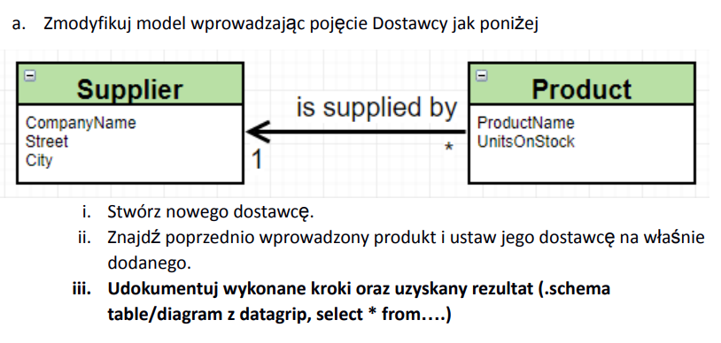
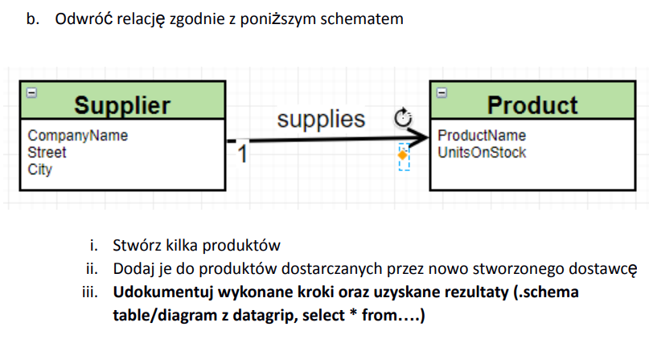
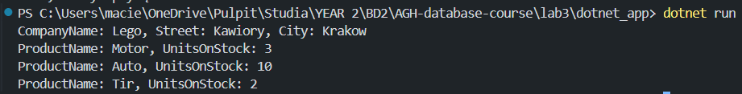
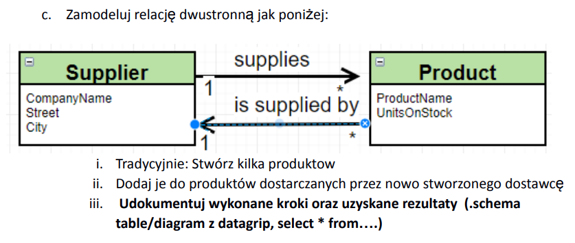
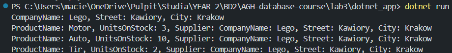
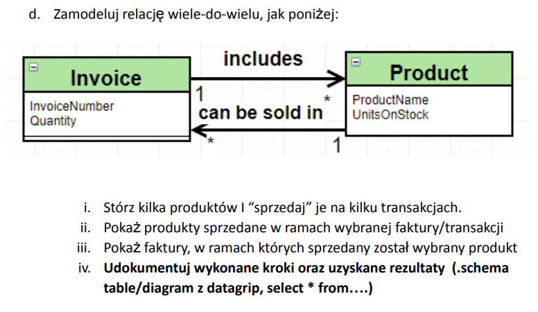
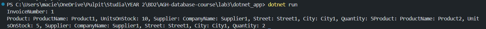
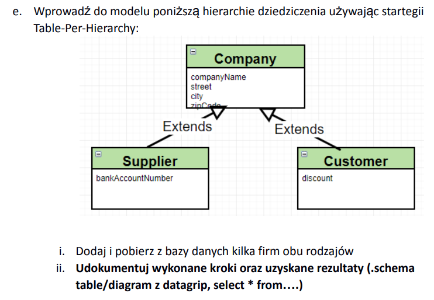
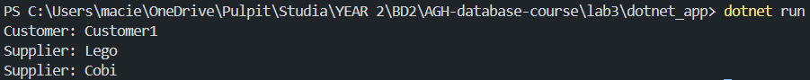
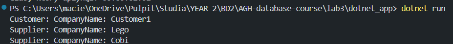

### Zadanie a

```cs
public class Product{
    public int ProductID { get; set; }
    public string? ProductName { get; set; }
    public int UnitsOnStock { get; set; }
    public Supplier? Supplier { get; set; } = null;

    public override string ToString()
    {
        return $"ProductName: {ProductName}, UnitsOnStock: {UnitsOnStock}, Supplier: {Supplier}";
    }
}
```
```cs
public class Supplier{
    public int SupplierID { get; set; }
    public string? CompanyName { get; set; }
    public string? Street { get; set; }
    public string? City { get; set; }

    override public string ToString(){
        return $"CompanyName: {CompanyName}, Street: {Street}, City: {City}";
    }
}
```
```cs
using Microsoft.EntityFrameworkCore;

public class ShopContext: DbContext{
    public DbSet<Product> Products { get; set; }
    public DbSet<Supplier> Suppliers { get; set; }

    protected override void OnConfiguring(DbContextOptionsBuilder optionsBuilder)
    {
        base.OnConfiguring(optionsBuilder);
        optionsBuilder.UseSqlite("Data Source=my_database");
    }
}
```
```cs
class App{
    static void Main(){
        ShopContext context = new ShopContext();
        var supplier = createSupplier("Lego", "Kawiory", "Krakow");
        var product = createProduct("Zamek", 10);
        product.Supplier = supplier;
        context.Suppliers.Add(supplier);
        context.Products.Add(product);

        context.SaveChanges();
        printProducts(context);
    }

    private static Product createProduct(string Name, int UnitsOnStock){
        Product product = new Product();
        product.ProductName = Name;
        product.UnitsOnStock = UnitsOnStock;
        return product;
    }

    private static Supplier createSupplier(string CompanyName, string Street, string City){
        Supplier supplier = new Supplier();
        supplier.CompanyName = CompanyName;
        supplier.Street = Street;
        supplier.City = City;
        return supplier;
    }

    private static void printProducts(ShopContext context){
        foreach(var product in context.Products){
            Console.WriteLine(product);
        }
    }
}
```

### Zadanie b

```cs
public class Product{
    public int ProductID { get; set; }
    public string? ProductName { get; set; }
    public int UnitsOnStock { get; set; }

    public override string ToString()
    {
        return $"ProductName: {ProductName}, UnitsOnStock: {UnitsOnStock}";
    }
}
```
```cs
public class Supplier{
    public int SupplierID { get; set; }
    public string? CompanyName { get; set; }
    public string? Street { get; set; }
    public string? City { get; set; }
    public ICollection<Product> Products { get; set; } = new List<Product>();

    override public string ToString(){
        return $"CompanyName: {CompanyName}, Street: {Street}, City: {City}";
    }
}
```
```cs
using Microsoft.EntityFrameworkCore;

public class ShopContext: DbContext{
    public DbSet<Product> Products { get; set; }
    public DbSet<Supplier> Suppliers { get; set; }

    protected override void OnConfiguring(DbContextOptionsBuilder optionsBuilder)
    {
        base.OnConfiguring(optionsBuilder);
        optionsBuilder.UseSqlite("Data Source=my_database");
    }
}
```
```cs
class App{
    static void Main(){
        ShopContext context = new ShopContext();
        var supplier = CreateSupplier("Lego", "Kawiory", "Krakow");
        var product1 = CreateProduct("Motor", 3);
        var product2 = CreateProduct("Auto", 10);
        var product3 = CreateProduct("Tir", 2);
        supplier.Products.Add(product1);
        supplier.Products.Add(product2);
        supplier.Products.Add(product3);

        context.Products.Add(product1);
        context.Products.Add(product2);
        context.Products.Add(product3);
        context.Suppliers.Add(supplier);

        context.SaveChanges();
        Print(context);
    }

    private static Product CreateProduct(string Name, int UnitsOnStock){
        Product product = new Product
        {
            ProductName = Name,
            UnitsOnStock = UnitsOnStock
        };
        return product;
    }

    private static Supplier CreateSupplier(string CompanyName, string Street, string City){
        Supplier supplier = new()
        {
            CompanyName = CompanyName,
            Street = Street,
            City = City
        };
        return supplier;
    }

    private static void Print(ShopContext context){
        foreach(var suppliar in context.Suppliers){
            Console.WriteLine(suppliar);
            foreach(var product in suppliar.Products){
                Console.WriteLine(product);
            }
        }
    }
}
```

### Zadanie c

```cs
public class Product{
    public int ProductID { get; set; }
    public string? ProductName { get; set; }
    public int UnitsOnStock { get; set; }
    public Supplier? Supplier { get; set; }

    public override string ToString()
    {
        return $"ProductName: {ProductName}, UnitsOnStock: {UnitsOnStock}, Supplier: {Supplier}";
    }
}
```
```cs
public class Supplier{
    public int SupplierID { get; set; }
    public string? CompanyName { get; set; }
    public string? Street { get; set; }
    public string? City { get; set; }
    public ICollection<Product> Products { get; set; } = new List<Product>();

    override public string ToString(){
        return $"CompanyName: {CompanyName}, Street: {Street}, City: {City}";
    }
}
```
```cs
using Microsoft.EntityFrameworkCore;

public class ShopContext: DbContext{
    public DbSet<Product> Products { get; set; }
    public DbSet<Supplier> Suppliers { get; set; }

    protected override void OnConfiguring(DbContextOptionsBuilder optionsBuilder)
    {
        base.OnConfiguring(optionsBuilder);
        optionsBuilder.UseSqlite("Data Source=my_database");
    }
}
```
```cs
class App{
    static void Main(){
        ShopContext context = new ShopContext();
        var supplier = CreateSupplier("Lego", "Kawiory", "Krakow");
        var product1 = CreateProduct("Motor", 3, supplier);
        var product2 = CreateProduct("Auto", 10, supplier);
        var product3 = CreateProduct("Tir", 2, supplier);
        supplier.Products.Add(product1);
        supplier.Products.Add(product2);
        supplier.Products.Add(product3);

        context.Products.Add(product1);
        context.Products.Add(product2);
        context.Products.Add(product3);
        context.Suppliers.Add(supplier);

        context.SaveChanges();
        Print(context);
    }

    private static Product CreateProduct(string Name, int UnitsOnStock, Supplier supplier){
        Product product = new Product
        {
            ProductName = Name,
            UnitsOnStock = UnitsOnStock,
            Supplier = supplier
        };
        return product;
    }

    private static Supplier CreateSupplier(string CompanyName, string Street, string City){
        Supplier supplier = new()
        {
            CompanyName = CompanyName,
            Street = Street,
            City = City
        };
        return supplier;
    }

    private static void Print(ShopContext context){
        foreach(var suppliar in context.Suppliers){
            Console.WriteLine(suppliar);
            foreach(var product in suppliar.Products){
                Console.WriteLine(product);
            }
        }
    }
}
```

### Zadanie d

```cs
public class Product{
    public int ProductID { get; set; }
    public string? ProductName { get; set; }
    public int UnitsOnStock { get; set; }

    public Supplier? Supplier { get; set; }
    
    public virtual ICollection<ProductInvoice>? ProductInvoices { get; set; } = new List<ProductInvoice>();
    public override string ToString()
    {
        return $"ProductName: {ProductName}, UnitsOnStock: {UnitsOnStock}, Supplier: {Supplier}";
    }
}
```
```cs
public class Supplier{
    public int SupplierID { get; set; }
    public string? CompanyName { get; set; }
    public string? Street { get; set; }
    public string? City { get; set; }
    public ICollection<Product> Products { get; set; } = new List<Product>();

    override public string ToString(){
        return $"CompanyName: {CompanyName}, Street: {Street}, City: {City}";
    }
}
```
```cs
using System.ComponentModel.DataAnnotations;
using System.Text;

public class Invoice{
    [Key]
    public int InvoiceNumber{get; set;}
    
    public virtual ICollection<ProductInvoice> ProductInvoices { get; set; } = new List<ProductInvoice>();

    public override string ToString()
    {
        StringBuilder sb = new();
        sb.Append($"InvoiceNumber: {InvoiceNumber}\n");
        foreach(var productInvoice in ProductInvoices){
            sb.Append(productInvoice);
        }
        return sb.ToString();
    }
}
```
```cs
using System.ComponentModel.DataAnnotations;
using System.ComponentModel.DataAnnotations.Schema;

public class ProductInvoice{
    [Key, Column(Order=0)]
    public int InvoiceNumber { get; set; }

    [Key, Column(Order=1)]
    public int ProductID { get; set; }

    public virtual Invoice? Invoice { get; set; }
    
    public virtual Product? Product {get; set;}

    public int Quantity {get; set;}

    public override string ToString()
    {
        return $"Product: {Product}, Quantity: {Quantity}";
    }
}
```
```cs
using Microsoft.EntityFrameworkCore;

public class AppContext: DbContext{
    public DbSet<Product> Products { get; set; }
    public DbSet<Supplier> Suppliers { get; set; }
    public DbSet<Invoice> Invoice { get; set; }
    public DbSet<ProductInvoice> ProductInvoice { get; set; }

    protected override void OnConfiguring(DbContextOptionsBuilder optionsBuilder)
    {
        base.OnConfiguring(optionsBuilder);
        optionsBuilder.UseSqlite("Data Source=my_database");
    }

    protected override void OnModelCreating(ModelBuilder modelBuilder)
    {
      modelBuilder.Entity<ProductInvoice>()
          .HasKey(x => new { x.InvoiceNumber, x.ProductID });
    }
}
```
```cs
class App{
    static void Main(){
        AppContext context = new AppContext();
        var supplier = new Supplier { CompanyName = "Supplier1", Street = "Street1", City = "City1" };
        var product1 = new Product { ProductName = "Product1", UnitsOnStock = 10, Supplier = supplier };
        var product2 = new Product { ProductName = "Product2", UnitsOnStock = 5, Supplier = supplier };
        var invoice = new Invoice { InvoiceNumber = 1 };
        var productInvoice1 = new ProductInvoice { Invoice = invoice, Product = product1, Quantity = 5 };
        var productInvoice2 = new ProductInvoice { Invoice = invoice, Product = product2, Quantity = 2 };

        context.Suppliers.Add(supplier);
        context.Products.Add(product1);
        context.Products.Add(product2);
        context.Invoice.Add(invoice);
        context.ProductInvoice.Add(productInvoice1);
        context.ProductInvoice.Add(productInvoice2);

        context.SaveChanges();

        foreach (var i in context.Invoice){
            Console.WriteLine(i);
        }
    }    
}
```

### Zadanie e

```cs
public abstract class Company{
    public int CompanyID { get; set; }
    public string? CompanyName { get; set; }
    public string? Street { get; set; }
    public string? City { get; set; }
    public string? ZipCode { get; set; }

    public override string ToString(){
        return $"CompanyName: {CompanyName}";
    }
}
```
```cs
public class Supplier: Company{
    public int SupplierID { get; set; }
    public string? BankAccountNumber { get; set; }
    public override string ToString(){
        return $"Supplier: {base.ToString()}";
    }
}
```
```cs
public class Customer: Company{
    public int CustomerID { get; set; }
    public double Discount { get; set; }
    
    public override string ToString(){
        return $"Customer: {base.ToString()}";
    }

}
```
```cs
using Microsoft.EntityFrameworkCore;

public class AppContext: DbContext{
    public DbSet<Company> Companies { get; set; }
    public DbSet<Supplier> Suppliers { get; set; }
    public DbSet<Customer> Customer { get; set; }

    protected override void OnConfiguring(DbContextOptionsBuilder optionsBuilder)
    {
        base.OnConfiguring(optionsBuilder);
        optionsBuilder.UseSqlite("Data Source=my_database");
    }
}
```
```cs
class App{
    static void Main(){
        AppContext context = new AppContext();
        var supplier1 = new Supplier { CompanyName = "Lego", Street = "Street1", 
            City = "City1", ZipCode = "ZipCode1", BankAccountNumber = "123"};
        var supplier2 = new Supplier { CompanyName = "Cobi", Street = "Street1", 
            City = "City1", ZipCode = "ZipCode1", BankAccountNumber = "BankAccountNumber1"};
        var customer1 = new Customer { CompanyName = "Customer1", Street = "Street1",
            City = "City1", ZipCode = "ZipCode1", Discount = 20.3};
        
        

        context.Companies.Add(supplier1);
        context.Companies.Add(supplier2);
        context.Companies.Add(customer1);

        context.SaveChanges();

        foreach (var i in context.Companies){
            Console.WriteLine(i);
        }
    }    
}
```

### Zadanie f

```cs
public abstract class Company{
    public int CompanyID { get; set; }
    public string? CompanyName { get; set; }
    public string? Street { get; set; }
    public string? City { get; set; }
    public string? ZipCode { get; set; }

    public override string ToString(){
        return $"CompanyName: {CompanyName}";
    }
}
```
```cs
using System.ComponentModel.DataAnnotations.Schema;

[Table("Suppliers")]
public class Supplier: Company{
    public int SupplierID { get; set; }
    public string? BankAccountNumber { get; set; }
    public override string ToString(){
        return $"Supplier: {base.ToString()}";
    }
}
```
```cs
using System.ComponentModel.DataAnnotations.Schema;

[Table("Customers")]
public class Customer: Company{
    public int CustomerID { get; set; }
    public double Discount { get; set; }
    
    public override string ToString(){
        return $"Customer: {base.ToString()}";
    }

}
```
```cs
using Microsoft.EntityFrameworkCore;

public class AppContext: DbContext{
    public DbSet<Company> Companies { get; set; }
    public DbSet<Supplier> Suppliers { get; set; }
    public DbSet<Customer> Customer { get; set; }

    protected override void OnConfiguring(DbContextOptionsBuilder optionsBuilder)
    {
        base.OnConfiguring(optionsBuilder);
        optionsBuilder.UseSqlite("Data Source=my_database");
    }
}
```
```cs
class App{
    static void Main(){
        AppContext context = new AppContext();
        var supplier1 = new Supplier { CompanyName = "Lego", Street = "Street1", 
            City = "City1", ZipCode = "ZipCode1", BankAccountNumber = "123"};
        var supplier2 = new Supplier { CompanyName = "Cobi", Street = "Street1", 
            City = "City1", ZipCode = "ZipCode1", BankAccountNumber = "BankAccountNumber1"};
        var customer1 = new Customer { CompanyName = "Customer1", Street = "Street1",
            City = "City1", ZipCode = "ZipCode1", Discount = 20.3};
        
        

        context.Companies.Add(supplier1);
        context.Companies.Add(supplier2);
        context.Companies.Add(customer1);

        context.SaveChanges();

        foreach (var i in context.Companies){
            Console.WriteLine(i);
        }
    }    
}
```

### Zadanie g

Pierwsza strategia(Table-Per-Hierarchy) tworzy jedną tabelę przechowującą zarówno klientów jak i dostawców, tworzy wszystkie potrzebne kolumny wraz z kolumną określającą czy dany rekord reprezentuje dostawcę czy klienta.

Druga strategia(Table-Per-Type) tworzy trzy tabele dla firm, klientów i dostawców. Tabela Company dla firm trzyma dane z klasy abstrakcyjnej Company, natomiast odpowiednio tabele Customers i Suppliers trzymają tylko atrybuty charakterystyczne dla danej klasy dziedziczącej i indeks odpowiadającego rekordu w tabeli Company.

Wydaje się, że użycie drugiej strategii jest bardziej przejrzyste, czytelne i moim zdaniem optymalne. Dosyć transparentnie odwzorowuje ideę dziedziczenia.