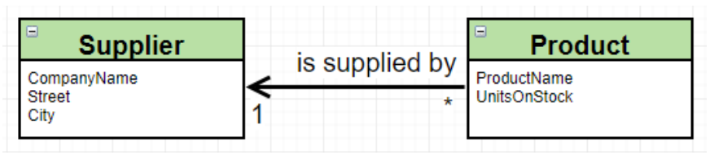
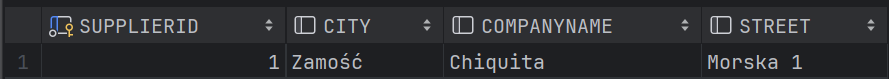
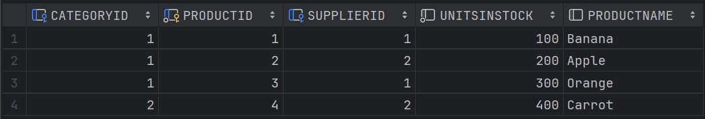

# Część 1 
```java
//Main
package com.maciejmakowski2003;

import org.hibernate.HibernateException;
import org.hibernate.Session;
import org.hibernate.SessionFactory;
import org.hibernate.Transaction;
import org.hibernate.cfg.Configuration;

public class Main {
    private static final SessionFactory sessionFactory;

    static {
        try {
            Configuration configuration = new Configuration();
            sessionFactory = configuration.configure().buildSessionFactory();
        } catch (Throwable ex) {
            throw new ExceptionInInitializerError(ex);
        }
    }

    public static Session getSession() throws HibernateException {
        return sessionFactory.openSession();
    }

    public static void main(final String[] args) {
        try (Session session = getSession()) {
            Product product = new Product("Krzesło", 111);
            Transaction tx = session.beginTransaction();
            session.save(product);
            tx.commit();
        }
    }
}
```
```java
//Product
package com.maciejmakowski2003;

import jakarta.persistence.Entity;
import jakarta.persistence.GeneratedValue;
import jakarta.persistence.GenerationType;
import jakarta.persistence.Id;

@Entity
public class Product {
    @Id
    @GeneratedValue(strategy = GenerationType.AUTO)
    public int productID;
    public String productName;
    public int unitsInStock;

    public Product() {}

    public Product(String productName, int unitsInStock) {
        this.productName = productName;
        this.unitsInStock = unitsInStock;
    }
}
```
```xml
//hibernate.cfg.xml
<?xml version='1.0' encoding='utf-8'?>
<!DOCTYPE hibernate-configuration PUBLIC
        "-//Hibernate/Hibernate Configuration DTD 3.0//EN"
        "http://www.hibernate.org/dtd/hibernate-configuration-3.0.dtd">
<hibernate-configuration>
    <session-factory>
        <property name="connection.driver_class">org.apache.derby.jdbc.ClientDriver</property>
        <property name="connection.url">jdbc:derby://127.0.0.1/MaciejMakowskiDatabase;create=true</property>

        <property name="show_sql">true</property>
        <property name="format_sql">true</property>
        <property name="use_sql_comments">true</property>
        <property name="hbm2ddl.auto">create-drop</property>

        <mapping class="com.maciejmakowski2003.Product"/>
    </session-factory>
</hibernate-configuration>
```


# Część 2

## Zadanie I

```java
//Main
package com.maciejmakowski2003;

import jakarta.persistence.Query;
import org.hibernate.HibernateException;
import org.hibernate.Session;
import org.hibernate.SessionFactory;
import org.hibernate.Transaction;
import org.hibernate.cfg.Configuration;

public class Main {
    private static final SessionFactory sessionFactory;

    static {
        try {
            Configuration configuration = new Configuration();
            sessionFactory = configuration.configure().buildSessionFactory();
        } catch (Throwable ex) {
            throw new ExceptionInInitializerError(ex);
        }
    }

    public static Session getSession() throws HibernateException {
        return sessionFactory.openSession();
    }

    public static void main(final String[] args) {
        try (Session session = getSession()) {
            Transaction tx = session.beginTransaction();

            Supplier supplier = new Supplier("Chiquita", "Morska 1", "Zamość");

            Product product = session.get(Product.class, 1);
            product.setSupplier(supplier);
            session.save(supplier);

            tx.commit();

            Query query = session.createQuery("from Product");
            query.getResultList().forEach(System.out::println);
        }
    }
}
```
```java
//Product
package com.maciejmakowski2003;

import jakarta.persistence.*;

@Entity
public class Product {
    @Id
    @GeneratedValue(strategy = GenerationType.AUTO)
    private int productID;
    private String productName;
    private int unitsInStock;

    @ManyToOne
    @JoinColumn(name = "supplierID")
    private Supplier supplier;

    public Product() {}

    public Product(String productName, int unitsInStock) {
        this.productName = productName;
        this.unitsInStock = unitsInStock;
    }

    @Override
    public String toString(){
        return productName + " " + unitsInStock + " supplied by " + supplier;
    }

    public Supplier getSupplier(){
        return supplier;
    }

    public void setSupplier(Supplier supplier){
        this.supplier = supplier;
    }
}
```
```java
//Supplier
package com.maciejmakowski2003;

import jakarta.persistence.*;

@Entity
public class Supplier {
    @Id
    @GeneratedValue(strategy = GenerationType.AUTO)
    public int supplierID;

    public String companyName;
    public String street;
    public String city;

    public Supplier() {};

    public Supplier(String companyName, String street, String city) {
        this.companyName = companyName;
        this.street = street;
        this.city = city;
    }

    @Override
    public String toString(){
        return companyName;
    }
}
```


## Zadanie II

#### a) Bez tabeli łącznikowej
```java
//Main
package com.maciejmakowski2003;

import jakarta.persistence.Query;
import org.hibernate.HibernateException;
import org.hibernate.Session;
import org.hibernate.SessionFactory;
import org.hibernate.Transaction;
import org.hibernate.cfg.Configuration;

import java.util.List;

public class Main {
    private static final SessionFactory sessionFactory;

    static {
        try {
            Configuration configuration = new Configuration();
            sessionFactory = configuration.configure().buildSessionFactory();
        } catch (Throwable ex) {
            throw new ExceptionInInitializerError(ex);
        }
    }

    public static Session getSession() throws HibernateException {
        return sessionFactory.openSession();
    }

    public static void main(final String[] args) {
        try (Session session = getSession()) {
            Transaction tx = session.beginTransaction();

            Supplier supplier = new Supplier("Chiquita", "Morska 1", "Zamość");
            Product product1 = new Product("Banana", 100);
            Product product2 = new Product("Apple", 200);
            Product product3 = new Product("Orange", 300);

            supplier.addProduct(List.of(product1, product2, product3));
            session.save(product1);
            session.save(product2);
            session.save(product3);
            session.save(supplier);

            tx.commit();

            Query query = session.createQuery("from Supplier");
            query.getResultList().forEach(s -> {
                Supplier supplier1 = (Supplier) s;
                System.out.println(supplier1);
                supplier1.getProducts().forEach(System.out::println);
            });
        }
    }
}
```
```java
//Product
package com.maciejmakowski2003;

import jakarta.persistence.*;

@Table(name = "Products")
@Entity
@SequenceGenerator(name = "Product_SEQ")
public class Product {
    @Id
    @GeneratedValue(strategy = GenerationType.AUTO, generator = "Product_SEQ")
    private int productID;
    private String productName;
    private int unitsInStock;

    public Product() {}

    public Product(String productName, int unitsInStock) {
        this.productName = productName;
        this.unitsInStock = unitsInStock;
    }

    @Override
    public String toString(){
        return productName + " " + unitsInStock;
    }
}
```
```java
//Supplier
package com.maciejmakowski2003;

import jakarta.persistence.*;

import java.util.ArrayList;
import java.util.Collection;
import java.util.List;

@Table(name = "Suppliers")
@Entity
@SequenceGenerator(name = "Supplier_SEQ")
public class Supplier {
    @Id
    @GeneratedValue(strategy = GenerationType.AUTO, generator = "Supplier_SEQ")
    public int supplierID;

    public String companyName;
    public String street;
    public String city;

    @OneToMany
    @JoinColumn(name = "supplierID")
    private final Collection<Product> products = new ArrayList<>();

    public Supplier() {};

    public Supplier(String companyName, String street, String city) {
        this.companyName = companyName;
        this.street = street;
        this.city = city;
    }

    @Override
    public String toString(){
        return companyName;
    }

    public Collection<Product> getProducts(){
        return products;
    }

    public void addProduct(List<Product> productsList){
        products.addAll(productsList);
    }
}
```




#### b) Z tabelą łącznikową
```java
//Main tak jak w podpunkcie a
```
```java
//Product
package com.maciejmakowski2003;

import jakarta.persistence.*;

@Table(name = "Products")
@Entity
@SequenceGenerator(name = "Product_SEQ")
public class Product {
    @Id
    @GeneratedValue(strategy = GenerationType.AUTO, generator = "Product_SEQ")
    private int productID;
    private String productName;
    private int unitsInStock;

    public Product() {}

    public Product(String productName, int unitsInStock) {
        this.productName = productName;
        this.unitsInStock = unitsInStock;
    }

    @Override
    public String toString(){
        return productName + " " + unitsInStock;
    }
}
```
```java
//Supplier
package com.maciejmakowski2003;

import jakarta.persistence.*;

import java.util.ArrayList;
import java.util.Collection;
import java.util.List;

@Table(name = "Suppliers")
@Entity
@SequenceGenerator(name = "Supplier_SEQ")
public class Supplier {
    @Id
    @GeneratedValue(strategy = GenerationType.AUTO, generator = "Supplier_SEQ")
    public int supplierID;

    public String companyName;
    public String street;
    public String city;

    @OneToMany
    private final Collection<Product> products = new ArrayList<>();

    public Supplier() {};

    public Supplier(String companyName, String street, String city) {
        this.companyName = companyName;
        this.street = street;
        this.city = city;
    }

    @Override
    public String toString(){
        return companyName;
    }

    public Collection<Product> getProducts(){
        return products;
    }

    public void addProduct(List<Product> productsList){
        products.addAll(productsList);
    }
}
```


## Zadanie III

```java
//Main
package com.maciejmakowski2003;

import jakarta.persistence.Query;
import org.hibernate.HibernateException;
import org.hibernate.Session;
import org.hibernate.SessionFactory;
import org.hibernate.Transaction;
import org.hibernate.cfg.Configuration;

import java.util.List;

public class Main {
    private static final SessionFactory sessionFactory;

    static {
        try {
            Configuration configuration = new Configuration();
            sessionFactory = configuration.configure().buildSessionFactory();
        } catch (Throwable ex) {
            throw new ExceptionInInitializerError(ex);
        }
    }

    public static Session getSession() throws HibernateException {
        return sessionFactory.openSession();
    }

    public static void main(final String[] args) {
        try (Session session = getSession()) {
            Transaction tx = session.beginTransaction();

            Supplier supplier1 = new Supplier("Chiquita", "Morska 1", "Zamość");
            Supplier supplier2 = new Supplier("Dole", "Morska 2", "Zamość");
            Product product1 = new Product("Banana", 100);
            Product product2 = new Product("Apple", 200);
            Product product3 = new Product("Orange", 300);

            supplier1.addProduct(List.of(product1, product3));
            product1.setSupplier(supplier1);
            product3.setSupplier(supplier1);
            supplier2.addProduct(List.of(product2));
            product2.setSupplier(supplier2);

            session.save(product1);
            session.save(product2);
            session.save(product3);
            session.save(supplier1);
            session.save(supplier2);

            tx.commit();

            Query query = session.createQuery("from Supplier");
            query.getResultList().forEach(s -> {
                Supplier supplier = (Supplier) s;
                System.out.println("Dostawca: " + supplier);
                supplier.getProducts().forEach(System.out::println);
            });

            Query query2 = session.createQuery("from Product");
            query2.getResultList().forEach(p -> {
                Product product = (Product) p;
                System.out.println(product + " dostarczany przez: " + product.getSupplier());
            });
        }
    }
}
```
```java
//Product
package com.maciejmakowski2003;

import jakarta.persistence.*;

@Entity
@Table(name = "Products")
public class Product {
    @Id
    @GeneratedValue(strategy = GenerationType.SEQUENCE)
    private int productID;

    private String productName;
    private int unitsInStock;

    @ManyToOne
    @JoinColumn(name = "supplierID")
    private Supplier supplier;

    public Product() {}

    public Product(String productName, int unitsInStock) {
        this.productName = productName;
        this.unitsInStock = unitsInStock;
    }

    @Override
    public String toString() {
        return productName + " " + unitsInStock;
    }

    public void setSupplier(Supplier supplier) {
        this.supplier = supplier;
    }

    public Supplier getSupplier() {
        return supplier;
    }
}
```
```java
package com.maciejmakowski2003;

import jakarta.persistence.*;

import java.util.ArrayList;
import java.util.Collection;
import java.util.List;

@Table(name = "Suppliers")
@Entity
public class Supplier {
    @Id
    @GeneratedValue(strategy = GenerationType.AUTO)
    public int supplierID;

    public String companyName;
    public String street;
    public String city;

    @OneToMany(mappedBy = "supplier")
    private Collection<Product> products = new ArrayList<>();

    public Supplier() {};

    public Supplier(String companyName, String street, String city) {
        this.companyName = companyName;
        this.street = street;
        this.city = city;
    }

    @Override
    public String toString(){
        return companyName;
    }

    public Collection<Product> getProducts(){
        return products;
    }

    public void addProduct(List<Product> productsList){
        products.addAll(productsList);
    }
}
```


## Zadanie IV

```java
//Main
package com.maciejmakowski2003;

import jakarta.persistence.Query;
import org.hibernate.HibernateException;
import org.hibernate.Session;
import org.hibernate.SessionFactory;
import org.hibernate.Transaction;
import org.hibernate.cfg.Configuration;

import java.util.List;

public class Main {
    private static final SessionFactory sessionFactory;

    static {
        try {
            Configuration configuration = new Configuration();
            sessionFactory = configuration.configure().buildSessionFactory();
        } catch (Throwable ex) {
            throw new ExceptionInInitializerError(ex);
        }
    }

    public static Session getSession() throws HibernateException {
        return sessionFactory.openSession();
    }

    public static void main(final String[] args) {
        try (Session session = getSession()) {
            Transaction tx = session.beginTransaction();

            Supplier supplier1 = new Supplier("Chiquita", "Morska 1", "Zamość");
            Supplier supplier2 = new Supplier("Dole", "Morska 2", "Zamość");
            Product product1 = new Product("Banana", 100);
            Product product2 = new Product("Apple", 200);
            Product product3 = new Product("Orange", 300);
            Product product4 = new Product("Carrot", 400);
            Category category1 = new Category("Fruits");
            Category category2 = new Category("Vegetables");

            supplier1.addProducts(List.of(product1, product3));
            product1.setSupplier(supplier1);
            product3.setSupplier(supplier1);
            supplier2.addProducts(List.of(product2, product4));
            product2.setSupplier(supplier2);
            product4.setSupplier(supplier2);

            category1.addProducts(List.of(product1, product2, product3));
            product1.setCategory(category1);
            product2.setCategory(category1);
            product3.setCategory(category1);
            category2.addProducts(List.of(product4));
            product4.setCategory(category2);

            session.save(product1);
            session.save(product2);
            session.save(product3);
            session.save(product4);
            session.save(supplier1);
            session.save(supplier2);
            session.save(category1);
            session.save(category2);

            tx.commit();

            Query query = session.createQuery("from Supplier");
            query.getResultList().forEach(s -> {
                Supplier supplier = (Supplier) s;
                System.out.println("Dostawca: " + supplier);
                supplier.getProducts().forEach(p -> System.out.println("Produkt: " + p + " z kategorii: " + p.getCategory()));
            });

            Query query2 = session.createQuery("from Category ");
            query2.getResultList().forEach(c -> {
                Category category = (Category) c;
                System.out.println("Kategoria: " + category);
                category.getProducts().forEach(p -> System.out.println("Produkt: " + p + " od dostawcy: " + p.getSupplier()));
            });
        }
    }
}
```
```java
//Product
package com.maciejmakowski2003;

import jakarta.persistence.*;

@Entity
@Table(name = "Products")
public class Product {
    @Id
    @GeneratedValue(strategy = GenerationType.SEQUENCE)
    private int productID;

    private String productName;
    private int unitsInStock;

    @ManyToOne
    @JoinColumn(name = "supplierID")
    private Supplier supplier;

    @ManyToOne
    @JoinColumn(name = "categoryID")
    private Category category;

    public Product() {}

    public Product(String productName, int unitsInStock) {
        this.productName = productName;
        this.unitsInStock = unitsInStock;
    }

    @Override
    public String toString() {
        return productName + " " + unitsInStock;
    }

    public void setSupplier(Supplier supplier) {
        this.supplier = supplier;
    }

    public Supplier getSupplier() {
        return supplier;
    }

    public void setCategory(Category category) {
        this.category = category;
    }

    public Category getCategory() {
        return category;
    }
}
```
```java
//Supplier
package com.maciejmakowski2003;

import jakarta.persistence.*;

import java.util.ArrayList;
import java.util.Collection;
import java.util.List;

@Table(name = "Suppliers")
@Entity
public class Supplier {
    @Id
    @GeneratedValue(strategy = GenerationType.AUTO)
    public int supplierID;

    public String companyName;
    public String street;
    public String city;

    @OneToMany(mappedBy = "supplier")
    private final Collection<Product> products = new ArrayList<>();

    public Supplier() {};

    public Supplier(String companyName, String street, String city) {
        this.companyName = companyName;
        this.street = street;
        this.city = city;
    }

    @Override
    public String toString(){
        return companyName;
    }

    public Collection<Product> getProducts(){
        return products;
    }

    public void addProducts(List<Product> productsList){
        products.addAll(productsList);
    }
}
```
```java
package com.maciejmakowski2003;

import jakarta.persistence.*;

import java.util.ArrayList;
import java.util.Collection;
import java.util.List;

@Entity
@Table(name = "Categories")
public class Category {
    @Id
    @GeneratedValue(strategy = GenerationType.SEQUENCE)
    private int categoryID;
    private String name;

    @OneToMany(mappedBy = "category")
    private final Collection<Product> products = new ArrayList<>();

    public Category() {}

    public Category(String name) {
        this.name = name;
    }

    @Override
    public String toString() {
        return name;
    }

    public Collection<Product> getProducts() {
        return products;
    }

    public void addProducts(List<Product> productsList) {
        products.addAll(productsList);
    }
}
```





## Zadanie V


```java
//Main
package com.maciejmakowski2003;

import jakarta.persistence.Query;
import org.hibernate.HibernateException;
import org.hibernate.Session;
import org.hibernate.SessionFactory;
import org.hibernate.Transaction;
import org.hibernate.cfg.Configuration;

import java.util.List;

public class Main {
    private static final SessionFactory sessionFactory;

    static {
        try {
            Configuration configuration = new Configuration();
            sessionFactory = configuration.configure().buildSessionFactory();
        } catch (Throwable ex) {
            throw new ExceptionInInitializerError(ex);
        }
    }

    public static Session getSession() throws HibernateException {
        return sessionFactory.openSession();
    }

    public static void main(final String[] args) {
        try (Session session = getSession()) {
            Transaction tx = session.beginTransaction();

            Supplier supplier1 = new Supplier("Chiquita", "Morska 1", "Zamość");
            Supplier supplier2 = new Supplier("Dole", "Morska 2", "Zamość");

            Category category1 = new Category("Fruits");
            Category category2 = new Category("Vegetables");

            Product product1 = new Product("Banana", 100, supplier1, category1);
            Product product2 = new Product("Apple", 200, supplier2, category1);
            Product product3 = new Product("Orange", 300, supplier1, category1);
            Product product4 = new Product("Carrot", 400, supplier2, category2);


            supplier1.addProducts(List.of(product1, product3));
            supplier2.addProducts(List.of(product2, product4));

            category1.addProducts(List.of(product1, product2, product3));
            category2.addProducts(List.of(product4));

            Invoice invoice1 = new Invoice();
            Invoice invoice2 = new Invoice();

            try{
                product1.sell(invoice1, 100);
                product1.sell(invoice2, 1);
            } catch(IllegalArgumentException e){
                System.out.println(e.getMessage());
            }

            product2.sell(invoice1, 200);
            product3.sell(invoice1, 15);
            product4.sell(invoice2, 150);

            session.save(product1);
            session.save(product2);
            session.save(product3);
            session.save(product4);
            session.save(supplier1);
            session.save(supplier2);
            session.save(category1);
            session.save(category2);
            session.save(invoice1);
            session.save(invoice2);

            tx.commit();

            Query query = session.createQuery("from Invoice");
            query.getResultList().forEach(i -> {
                Invoice invoice = (Invoice) i;
                System.out.println("Faktura: " + i);
                invoice.getProducts().forEach(p -> System.out.println("Produkt: " + p + " z kategorii: " + p.getCategory()));
            });

            Query query2 = session.createQuery("from Product ");
            query2.getResultList().forEach(p -> {
                Product product = (Product) p;
                System.out.println("Produkt: " + product);
                product.getInvoices().forEach(i -> System.out.println("Faktura: " + i));
            });
        }
    }
}
```
```java
//Product
package com.maciejmakowski2003;

import jakarta.persistence.*;

import java.util.Collection;
import java.util.HashSet;

@Entity
@Table(name = "Products")
public class Product {
    @Id
    @GeneratedValue(strategy = GenerationType.SEQUENCE)
    private int productID;

    private String productName;
    private int unitsInStock;

    @ManyToOne
    @JoinColumn(name = "supplierID")
    private Supplier supplier;

    @ManyToOne
    @JoinColumn(name = "categoryID")
    private Category category;

    @ManyToMany(mappedBy = "products")
    private final Collection<Invoice> invoices = new HashSet<>();

    public Product() {}

    public Product(String productName, int unitsInStock) {
        this.productName = productName;
        this.unitsInStock = unitsInStock;
    }

    public Product(String productName, int unitsInStock, Supplier supplier, Category category) {
        this.productName = productName;
        this.unitsInStock = unitsInStock;
        this.supplier = supplier;
        this.category = category;
    }

    @Override
    public String toString() {
        return productName + " " + unitsInStock;
    }

    public void setSupplier(Supplier supplier) {
        this.supplier = supplier;
    }

    public Supplier getSupplier() {
        return supplier;
    }

    public void setCategory(Category category) {
        this.category = category;
    }

    public Category getCategory() {
        return category;
    }

    public Collection<Invoice> getInvoices(){
        return invoices;
    }

    public void sell(Invoice invoice, int quantity) throws IllegalArgumentException{
        if(quantity > unitsInStock){
            throw new IllegalArgumentException("Not enough units in stock of prodcut: " + productName + " to sell " + quantity + " units");
        }

        unitsInStock -= quantity;
        invoices.add(invoice);
        invoice.addProduct(this, quantity);
    }
}
```
```java
//Invoice
package com.maciejmakowski2003;

import jakarta.persistence.*;

import java.util.ArrayList;
import java.util.Collection;
import java.util.HashSet;
import java.util.List;

@Entity
@Table(name = "Invoices")
public class Invoice {
    @Id
    @GeneratedValue(strategy = GenerationType.SEQUENCE)
    private int invoiceNumber;
    private int quantity = 0;

    @ManyToMany
    private final Collection<Product> products = new HashSet<>();

    public Invoice() {}

    @Override
    public String toString() {
        return "numer: " + invoiceNumber + " sumaryczna ilość produktów: " + quantity;
    }

    public Collection<Product> getProducts() {
        return products;
    }

    public int getQuantity() {
        return quantity;
    }

    public void addProduct(Product product, int productQuantity) {
        products.add(product);
        quantity+= productQuantity;
    }
}
```


## Zadanie VI


```java
//Main
package com.maciejmakowski2003;

import jakarta.persistence.*;

public class Main {
    private static final EntityManagerFactory emf;

    static {
        try {
            emf = Persistence.createEntityManagerFactory("dbConfig");
        } catch (Throwable ex) {
            throw new ExceptionInInitializerError(ex);
        }
    }

    public static EntityManager getEntityManager() {
        return emf.createEntityManager();
    }

    public static void main(final String[] args) {
        EntityManager em = getEntityManager();
        EntityTransaction etx = em.getTransaction();

        etx.begin();

        Product product1 = new Product("Banana", 100);
        Product product2 = new Product("Apple", 200);
        Product product3 = new Product("Orange", 300);
        Product product4 = new Product("Carrot", 400);

        Invoice invoice1 = new Invoice();
        Invoice invoice2 = new Invoice();

        em.persist(product1);
        em.persist(product2);
        em.persist(product3);
        em.persist(product4);
        em.persist(invoice1);
        em.persist(invoice2);

        etx.commit();

        etx.begin();

        try{
            product1.sell(invoice1, 100);
            product1.sell(invoice2, 1);
        } catch(IllegalArgumentException e){
            System.out.println(e.getMessage());
        }

        product2.sell(invoice1, 200);
        product3.sell(invoice1, 15);
        product4.sell(invoice2, 150);

        etx.commit();

        Query query = em.createQuery("from Invoice");
        query.getResultList().forEach(i -> {
            Invoice invoice = (Invoice) i;
            System.out.println("Faktura: " + i);
            invoice.getProducts().forEach(p -> System.out.println("Produkt: " + p + " z kategorii: " + p.getCategory()));
        });

        Query query2 = em.createQuery("from Product ");
        query2.getResultList().forEach(p -> {
            Product product = (Product) p;
            System.out.println("Produkt: " + product);
            product.getInvoices().forEach(i -> System.out.println("Faktura: " + i));
        });

        em.close();
    }
}
```


## Zadanie VII


```java
//Product
package com.maciejmakowski2003;

import jakarta.persistence.*;

import java.util.Collection;
import java.util.HashSet;

@Entity
@Table(name = "Products")
public class Product {
    @Id
    @GeneratedValue(strategy = GenerationType.SEQUENCE)
    private int productID;

    private String productName;
    private int unitsInStock;

    @ManyToOne
    @JoinColumn(name = "supplierID")
    private Supplier supplier;

    @ManyToOne
    @JoinColumn(name = "categoryID")
    private Category category;

    @ManyToMany(
            mappedBy = "products",
            cascade = CascadeType.PERSIST
    )
    private final Collection<Invoice> invoices = new HashSet<>();

    public Product() {}

    public Product(String productName, int unitsInStock) {
        this.productName = productName;
        this.unitsInStock = unitsInStock;
    }

    public Product(String productName, int unitsInStock, Supplier supplier, Category category) {
        this.productName = productName;
        this.unitsInStock = unitsInStock;
        this.supplier = supplier;
        this.category = category;
    }

    @Override
    public String toString() {
        return productName + " " + unitsInStock + " sztuk w magazynie";
    }

    public void setSupplier(Supplier supplier) {
        this.supplier = supplier;
    }

    public Supplier getSupplier() {
        return supplier;
    }

    public void setCategory(Category category) {
        this.category = category;
    }

    public Category getCategory() {
        return category;
    }

    public Collection<Invoice> getInvoices(){
        return invoices;
    }

    public void sell(Invoice invoice, int quantity) throws IllegalArgumentException{
        if(quantity > unitsInStock){
            throw new IllegalArgumentException("Not enough units in stock of prodcut: " + productName + " to sell " + quantity + " units");
        }

        unitsInStock -= quantity;
        invoices.add(invoice);
        invoice.addProduct(this, quantity);
    }
}
```

```java
package com.maciejmakowski2003;

import jakarta.persistence.*;

import java.util.Collection;
import java.util.HashSet;

@Entity
@Table(name = "Invoices")
public class Invoice {
    @Id
    @GeneratedValue(strategy = GenerationType.SEQUENCE)
    private int invoiceNumber;
    private int quantity = 0;

    @ManyToMany(cascade = CascadeType.PERSIST)
    private final Collection<Product> products = new HashSet<>();

    public Invoice() {}

    @Override
    public String toString() {
        return "numer: " + invoiceNumber + " sumaryczna ilość produktów: " + quantity;
    }

    public Collection<Product> getProducts() {
        return products;
    }


    public void addProduct(Product product, int productQuantity) {
        products.add(product);
        quantity+= productQuantity;
    }
}
```

#### a) Kaskadowe tworzenie faktur z nowymi produktami
```java
//Main
package com.maciejmakowski2003;

import jakarta.persistence.*;

public class Main {
    private static final EntityManagerFactory emf;

    static {
        try {
            emf = Persistence.createEntityManagerFactory("dbConfig");
        } catch (Throwable ex) {
            throw new ExceptionInInitializerError(ex);
        }
    }

    public static EntityManager getEntityManager() {
        return emf.createEntityManager();
    }

    public static void main(final String[] args) {
        EntityManager em = getEntityManager();
        EntityTransaction etx = em.getTransaction();

        Product product1 = new Product("Banana", 100);
        Product product2 = new Product("Apple", 200);
        Product product3 = new Product("Orange", 300);
        Product product4 = new Product("Carrot", 400);

        Invoice invoice1 = new Invoice();
        Invoice invoice2 = new Invoice();

        etx.begin();

        invoice1.addProduct(product1, 10);
        invoice1.addProduct(product2, 20);
        invoice1.addProduct(product3, 30);
        invoice2.addProduct(product4, 40);

        em.persist(invoice1);
        em.persist(invoice2);

        etx.commit();

        em.close();
    }
}
```


#### Kaskadowe tworzenie produktów z nową fakturą

```java
//Main
package com.maciejmakowski2003;

import jakarta.persistence.*;

public class Main {
    private static final EntityManagerFactory emf;

    static {
        try {
            emf = Persistence.createEntityManagerFactory("dbConfig");
        } catch (Throwable ex) {
            throw new ExceptionInInitializerError(ex);
        }
    }

    public static EntityManager getEntityManager() {
        return emf.createEntityManager();
    }

    public static void main(final String[] args) {
        EntityManager em = getEntityManager();
        EntityTransaction etx = em.getTransaction();

        Product product1 = new Product("Banana", 100);
        Product product2 = new Product("Apple", 200);
        Product product3 = new Product("Orange", 300);
        Product product4 = new Product("Carrot", 400);

        Invoice invoice1 = new Invoice();
        Invoice invoice2 = new Invoice();

        etx.begin();

        product1.sell(invoice1, 10);
        product2.sell(invoice1, 20);
        product3.sell(invoice2, 30);
        product4.sell(invoice2, 40);

        em.persist(product1);
        em.persist(product2);
        em.persist(product3);
        em.persist(product4);

        etx.commit();

        em.close();
    }
}
```


## Zadanie VIII


```java
//Main
package com.maciejmakowski2003;

import jakarta.persistence.*;

public class Main {
    private static final EntityManagerFactory emf;

    static {
        try {
            emf = Persistence.createEntityManagerFactory("dbConfig");
        } catch (Throwable ex) {
            throw new ExceptionInInitializerError(ex);
        }
    }

    public static EntityManager getEntityManager() {
        return emf.createEntityManager();
    }

    public static void main(final String[] args) {
        EntityManager em = getEntityManager();
        EntityTransaction etx = em.getTransaction();

        Supplier supplier1 = new Supplier("Supplier1", new Address("Street1", "City1"));
        Supplier supplier2 = new Supplier("Supplier2", new Address("Street2", "City2"));

        etx.begin();

        em.persist(supplier1);
        em.persist(supplier2);

        etx.commit();

        em.close();
    }
}
```

#### a) Adres wbudowany do tabeli dostawców


```java
//Supplier
package com.maciejmakowski2003;

import jakarta.persistence.*;

import java.util.ArrayList;
import java.util.Collection;
import java.util.List;

@Table(name = "Suppliers")
@Entity
public class Supplier {
    @Id
    @GeneratedValue(strategy = GenerationType.AUTO)
    private int supplierID;

    private String companyName;

    @Embedded
    private Address address;

    @OneToMany(mappedBy = "supplier")
    private final Collection<Product> products = new ArrayList<>();

    public Supplier() {};

    public Supplier(String companyName, Address address) {
        this.companyName = companyName;
        this.address = address;
    }

    @Override
    public String toString(){
        return companyName + " " + address.toString();
    }

    public Collection<Product> getProducts(){
        return products;
    }

    public void addProducts(List<Product> productsList){
        products.addAll(productsList);
    }
}
```
```java
//Address
package com.maciejmakowski2003;

import jakarta.persistence.Embeddable;

@Embeddable
public class Address {
    private String street;
    private String city;

    public Address() {}

    public Address(String street, String city) {
        this.street = street;
        this.city = city;
    }

    @Override
    public String toString() {
        return city + " " + street;
    }
}
```


#### b) Osobne tabele 

```java
//Supplier
package com.maciejmakowski2003;

import jakarta.persistence.*;

import java.util.ArrayList;
import java.util.Collection;
import java.util.List;

@Table(name = "Suppliers")
@Entity
@SecondaryTable(name = "Address")
public class Supplier {
    @Id
    @GeneratedValue(strategy = GenerationType.AUTO)
    private int supplierID;

    private String companyName;

    @Column(table = "Address")
    private String city;
    @Column(table = "Address")
    private String street;

    @OneToMany(mappedBy = "supplier")
    private final Collection<Product> products = new ArrayList<>();

    public Supplier() {};

    public Supplier(String companyName, String city, String street) {
        this.companyName = companyName;
        this.city = city;
        this.street = street;
    }

    @Override
    public String toString(){
        return companyName + " " + city + " " + street;
    }

    public Collection<Product> getProducts(){
        return products;
    }

    public void addProducts(List<Product> productsList){
        products.addAll(productsList);
    }
}
```


## Zadanie IX


```java
//Main
package com.maciejmakowski2003;

import jakarta.persistence.*;

public class Main {
    private static final EntityManagerFactory emf;

    static {
        try {
            emf = Persistence.createEntityManagerFactory("dbConfig");
        } catch (Throwable ex) {
            throw new ExceptionInInitializerError(ex);
        }
    }

    public static EntityManager getEntityManager() {
        return emf.createEntityManager();
    }

    public static void main(final String[] args) {
        EntityManager em = getEntityManager();
        EntityTransaction etx = em.getTransaction();

        Customer customer = new Customer("Company1", "Street1", "City1", "ZipCode1", 0.1);
        Supplier supplier = new Supplier("Company2", "Street2", "City2", "ZipCode2", "BankAccountNumber2");

        etx.begin();

        em.persist(customer);
        em.persist(supplier);

        etx.commit();

        em.close();
    }
}
```

```java
//Customer
package com.maciejmakowski2003;

import jakarta.persistence.*;

@Table(name = "Customers")
@Entity
public class Customer extends Company {
    double discount;

    public Customer() {}

    public Customer(String companyName, String street, String city, String zipCode, double discount) {
        super(companyName, street, city, zipCode);
        this.discount = discount;
    }
}
```

```java
//Supplier
package com.maciejmakowski2003;

import jakarta.persistence.*;

@Table(name = "Suppliers")
@Entity
public class Supplier extends Company {
    private String bankAccountNumber;

    public Supplier() {}

    public Supplier(String companyName, String street, String city, String zipCode, String bankAccountNumber) {
        super(companyName, street, city, zipCode);
        this.bankAccountNumber = bankAccountNumber;
    }
}
```

#### a) SINGLE_TABLE

```java
//Company
package com.maciejmakowski2003;

import jakarta.persistence.*;

@Entity
@Inheritance(strategy = InheritanceType.SINGLE_TABLE)
public class Company {
    @Id
    @GeneratedValue(strategy = GenerationType.SEQUENCE)
    private int companyID;

    private String companyName;
    private String street;
    private String city;
    private String zipCode;

    public Company() {}

    public Company(String companyName, String street, String city, String zipCode) {
        this.companyName = companyName;
        this.zipCode = zipCode;
        this.street = street;
        this.city = city;
    }

    @Override
    public String toString() {
        return companyName;
    }
}
```


#### b) Joined

```java
//Company
package com.maciejmakowski2003;

import jakarta.persistence.*;

@Entity
@Inheritance(strategy = InheritanceType.JOINED)
public class Company {
    @Id
    @GeneratedValue(strategy = GenerationType.SEQUENCE)
    private int companyID;

    private String companyName;
    private String street;
    private String city;
    private String zipCode;

    public Company() {}

    public Company(String companyName, String street, String city, String zipCode) {
        this.companyName = companyName;
        this.zipCode = zipCode;
        this.street = street;
        this.city = city;
    }

    @Override
    public String toString() {
        return companyName;
    }
}
```


#### c) TABLE_PER_CLASS

```java
//Company
package com.maciejmakowski2003;

import jakarta.persistence.*;

@Entity
@Inheritance(strategy = InheritanceType.TABLE_PER_CLASS)
public class Company {
    @Id
    @GeneratedValue(strategy = GenerationType.SEQUENCE)
    private int companyID;

    private String companyName;
    private String street;
    private String city;
    private String zipCode;

    public Company() {}

    public Company(String companyName, String street, String city, String zipCode) {
        this.companyName = companyName;
        this.zipCode = zipCode;
        this.street = street;
        this.city = city;
    }

    @Override
    public String toString() {
        return companyName;
    }
}
```


